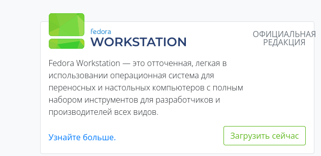
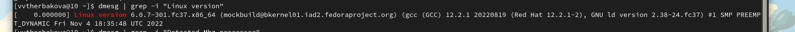
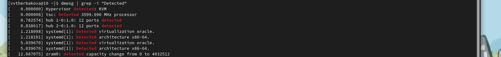
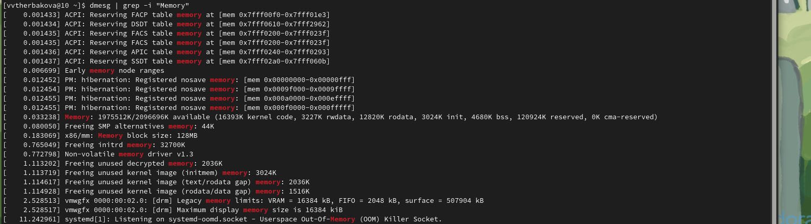
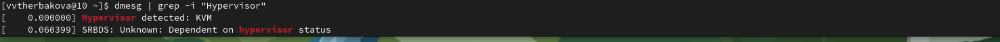
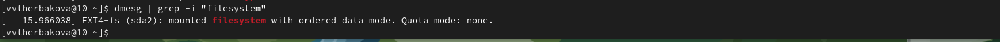
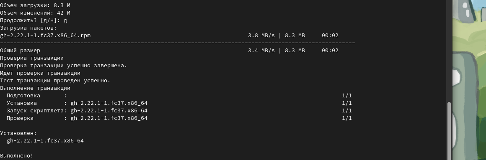

---
## Front matter
title: "Лабораторная работа №2"
subtitle: "Операционные системы"
author: "Щербакова Вероника НБИбд-03-22"

## Generic otions
lang: ru-RU
toc-title: "Содержание"

## Bibliography
bibliography: bib/cite.bib
csl: pandoc/csl/gost-r-7-0-5-2008-numeric.csl

## Pdf output format
toc: true # Table of contents
toc-depth: 2
lof: true # List of figures
lot: true # List of tables
fontsize: 12pt
linestretch: 1.5
papersize: a4
documentclass: scrreprt
## I18n polyglossia
polyglossia-lang:
  name: russian
  options:
	- spelling=modern
	- babelshorthands=true
polyglossia-otherlangs:
  name: english
## I18n babel
babel-lang: russian
babel-otherlangs: english
## Fonts
mainfont: PT Serif
romanfont: PT Serif
sansfont: PT Sans
monofont: PT Mono
mainfontoptions: Ligatures=TeX
romanfontoptions: Ligatures=TeX
sansfontoptions: Ligatures=TeX,Scale=MatchLowercase
monofontoptions: Scale=MatchLowercase,Scale=0.9
## Biblatex
biblatex: true
biblio-style: "gost-numeric"
biblatexoptions:
  - parentracker=true
  - backend=biber
  - hyperref=auto
  - language=auto
  - autolang=other*
  - citestyle=gost-numeric
## Pandoc-crossref LaTeX customization
figureTitle: "Рис."
tableTitle: "Таблица"
listingTitle: "Листинг"
lofTitle: "Список иллюстраций"
lotTitle: "Список таблиц"
lolTitle: "Листинги"
## Misc options
indent: true
header-includes:
  - \usepackage{indentfirst}
  - \usepackage{float} # keep figures where there are in the text
  - \floatplacement{figure}{H} # keep figures where there are in the text
---

# Цель работы

Приобретение практических навыков установки операционной системы на виртуальную машину, настройки минимально необходимых для дальнейшей работы сервисов.

# Задание

1. Дождитесь загрузки графического окружения и откройте терминал. В окне терминала проанализируйте последовательность загрузки системы, выполнив команду dmesg. Можно просто просмотреть вывод этой команды:

2. dmesg | less

3. Можно использовать поиск с помощью grep:

4. dmesg | grep -i "то, что ищем"

5. Получите следующую информацию.
        Версия ядра Linux (Linux version).
        Частота процессора (Detected Mhz processor).
        Модель процессора (CPU0).
        Объём доступной оперативной памяти (Memory available).
        Тип обнаруженного гипервизора (Hypervisor detected).
        Тип файловой системы корневого раздела.
        Последовательность монтирования файловых систем.

# Теоретическое введение

# Выполнение лабораторной работы

1. Скачивание виртуальой машины
{#fig:001 width=90%}

2. Скачание Федоры
{#fig:002 width=90%}

3. Загрузка
{#fig:003 width=90%}

4. Запуск машины
{#fig:004 width=90%}

5. Заполнение данных
{#fig:005 width=90%}

6. Взод в кабинет машины
{#fig:006 width=90%}

7. Машина успешно работает
{#fig:007 width=90%}

8. Версия ядра
{#fig:008 width=90%}

9. Частота пррррессора
{#fig:009 width=90%}

10. Модель процссора 
{#fig:010 width=90%}

11. Обье доступной операативной памяти
{#fig:011 width=90%}

12. Тип гипервизора
{#fig:012 width=90%}

13. Тип корневого раздела
{#fig:013 width=90%}

14. Последовательность монтироваания
{#fig:014 width=90%}
{#fig:015 width=90%}

# Выводы
Приобрели практические навыки установки операционной системы на виртуальную машину, настроили минимально необходимые для дальнейшей работы сервисы.

# Список литературы{.unnumbered}

::: {#refs}
::: 
