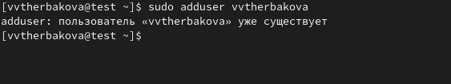
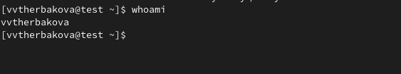
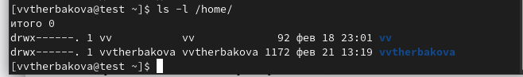
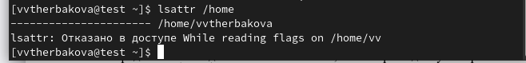
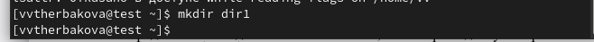
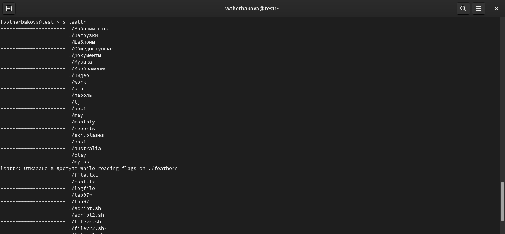
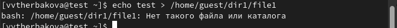

---
## Front matter
lang: ru-RU
title: Лаборатрная рабта №2
subtitle: 
author:
  - Щербакова Вероника
institute:
  - Российский университет дружбы народов, Москва, Россия
date: 18 февраля 2023

## i18n babel
babel-lang: russian
babel-otherlangs: english

## Formatting pdf
toc: false
toc-title: Содержание
slide_level: 2
aspectratio: 169
section-titles: true
theme: metropolis
header-includes:
 - \metroset{progressbar=frametitle,sectionpage=progressbar,numbering=fraction}
 - '\makeatletter'
 - '\beamer@ignorenonframefalse'
 - '\makeatother'
---

# Информация

## Докладчик

:::::::::::::: {.columns align=center}
::: {.column width="70%"}

  * Щербакова Вероника Владимировна
  * студентка группы НБИбд-03-22
  * Российский университет дружбы народов


:::
::::::::::::::

# Вводная часть

## Объект и предмет исследования

- Презентация как текст
- Программное обеспечение для создания презентаций
- Входные и выходные форматы презентаций

## Цели и задачи

Получение практических навыков работы в консоли с атрибутами фай-
лов, закрепление теоретических основ дискреционного разграничения до-
ступа в современных системах с открытым кодом на базе ОС Linux1

## Материалы и методы

- Процессор `pandoc` для входного формата Markdown
- Результирующие форматы
	- `pdf`
	- `html`
- Автоматизация процесса создания: `Makefile`

# Создание презентации

## Процессор `pandoc`

- Pandoc: преобразователь текстовых файлов
- Сайт: <https://pandoc.org/>
- Репозиторий: <https://github.com/jgm/pandoc>

## Формат `pdf`

- Использование LaTeX
- Пакет для презентации: [beamer](https://ctan.org/pkg/beamer)
- Тема оформления: `metropolis`

## Код для формата `pdf`

```yaml
slide_level: 2
aspectratio: 169
section-titles: true
theme: metropolis
```

## Формат `html`

- Используется фреймворк [reveal.js](https://revealjs.com/)
- Используется [тема](https://revealjs.com/themes/) `beige`

## Код для формата `html`

- Тема задаётся в файле `Makefile`

```make
REVEALJS_THEME = beige 
```
# Результаты

## Получающиеся форматы

- Полученный `pdf`-файл можно демонстрировать в любой программе просмотра `pdf`
- Полученный `html`-файл содержит в себе все ресурсы: изображения, css, скрипты
.

## Содержание исследования

1.  
{#fig:001 width=90%}
2. 
{#fig:002 width=90%}
3. 
{#fig:003 width=90%}
{#fig:004 width=90%}
4. 
{#fig:005 width=90%}
{#fig:006 width=90%}
5. 
{#fig:007 width=90%}
6. 
{#fig:008 width=90%}
7. 
{#fig:009 width=90%}
{#fig:010 width=90%}
{#fig:011 width=90%}
8. 
{#fig:012 width=90%}
9. 
{#fig:013 width=90%}
{#fig:014 width=90%}
{#fig:015 width=90%}

## Итоговый слайд

Получли практические навыки работы в консоли с атрибутами фай-
лов, закрепили теоретические основы дискреционного разграничения до-
ступа в современных системах с открытым кодом на базе ОС Linux1.
