---
## Front matter
lang: ru-RU
title: Лабораторная работа №4
subtitle: Презентация
author:
  - Щербакова В.В.
institute:
  - Российский университет дружбы народов, Москва, Россия
date: 3 марта 2023

## i18n babel
babel-lang: russian
babel-otherlangs: english

## Formatting pdf
toc: false
toc-title: Содержание
slide_level: 2
aspectratio: 169
section-titles: true
theme: metropolis
header-includes:
 - \metroset{progressbar=frametitle,sectionpage=progressbar,numbering=fraction}
 - '\makeatletter'
 - '\beamer@ignorenonframefalse'
 - '\makeatother'
---

# Информация

## Докладчик

:::::::::::::: {.columns align=center}
::: {.column width="70%"}

  * Щербакова Вероника Владимировна
  * Учиница
  * НБИбд-03-22
  * Российский университет дружбы народов

:::
::: {.column width="30%"}


:::
::::::::::::::

# Вводная часть

## Актуальность
- для тех, кто не умеет пользоваться систепой посредствам командной строки
- 
## Объект и предмет исследования

-
## Цели и задачи

- Приобретение практических навыков взаимодействия пользователя с системой по-
средством командной строки.

## Материалы и методы

- Процессор `pandoc` для входного формата Markdown
- Результирующие форматы
	- `pdf`
	- `html`
- Автоматизация процесса создания: `Makefile`

# Создание презентации

## Процессор `pandoc`

- Pandoc: преобразователь текстовых файлов
- Сайт: <https://pandoc.org/>
- Репозиторий: <https://github.com/jgm/pandoc>

## Формат `pdf`

- Использование LaTeX
- Пакет для презентации: [beamer](https://ctan.org/pkg/beamer)
- Тема оформления: `metropolis`

## Код для формата `pdf`

```yaml
slide_level: 2
aspectratio: 169
section-titles: true
theme: metropolis
```

## Формат `html`

- Используется фреймворк [reveal.js](https://revealjs.com/)
- Используется [тема](https://revealjs.com/themes/) `beige`

## Код для формата `html`

- Тема задаётся в файле `Makefile`

```make
REVEALJS_THEME = beige 
```
# Результаты

## Получающиеся форматы

- Полученный `pdf`-файл можно демонстрировать в любой программе просмотра `pdf`
- Полученный `html`-файл содержит в себе все ресурсы: изображения, css, скрипты

# Элементы презентации

## Актуальность


## Цели и задачи


## Материалы и методы


## Содержание исследования

1. Определите полное имя вашего домашнего каталога (рис. [-@fig:001])
{#fig:001 width=90%}
##
2. 1. Перейдите в каталог /tmp.тВыведите на экран содержимое каталога /tmp. Для этого используйте команду ls с различными опциями.(рис. [-@fig:002])
{#fig:002 width=90%}
##
    2. Определите, есть ли в каталоге /var/spool подкаталог с именем cron?(Нет)(рис. [-@fig:003])
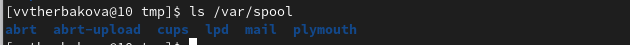{#fig:003 width=90%}
##
    3. Перейдите в Ваш домашний каталог и выведите на экран его содержимое. Опре-
делите, кто является владельцем файлов и подкаталогов? (Владельцем являюсь я, тк моя домашняя папка)(рис. [-@fig:004])
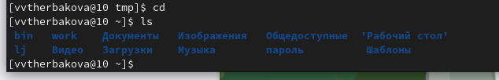{#fig:004 width=90%}
##
3.  1. домашнем каталоге создайте новый каталог с именем newdir.+ проверка создания(рис. [-@fig:005])
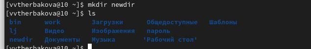{#fig:005 width=90%}
##
    2. В каталоге ~/newdir создайте новый каталог с именем morefun.(рис. [-@fig:006])
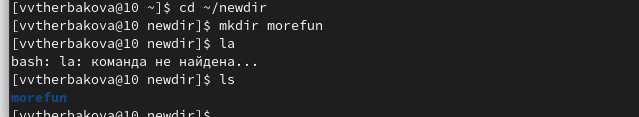{#fig:006 width=90%}
##
    3. В домашнем каталоге создайте одной командой три новых каталога с именами
letters, memos, misk. Затем удалите эти каталоги одной командой.(рис. [-@fig:007])
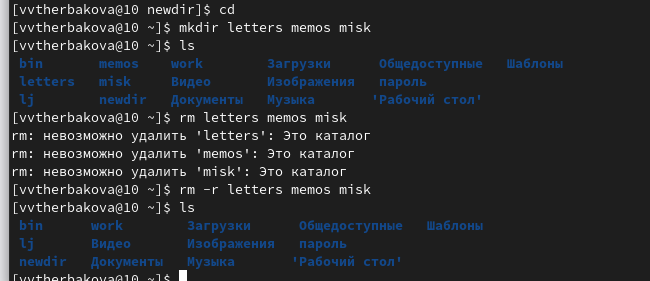{#fig:007 width=90%}
##
    4. Попробуйте удалить ранее созданный каталог ~/newdir командой rm. Проверьте,
был ли каталог удалён(рис. [-@fig:008])
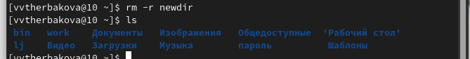{#fig:008 width=90%}
##
    5. Удалите каталог ~/newdir/morefun из домашнего каталога. Проверьте, был ли
каталог удалён.(Уже удален,тк удалили папку в которой он лежал)(рис. [-@fig:009])
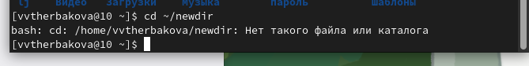{#fig:009 width=90%}
##
4. команды man(рис. [-@fig:010])
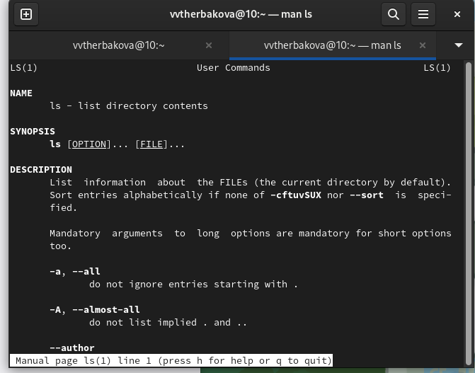{#fig:010 width=90%}
##
5. Используйте команду man для просмотра описания следующих команд: cd, pwd, mkdir,
rmdir, rm. (рис. [-@fig:011])
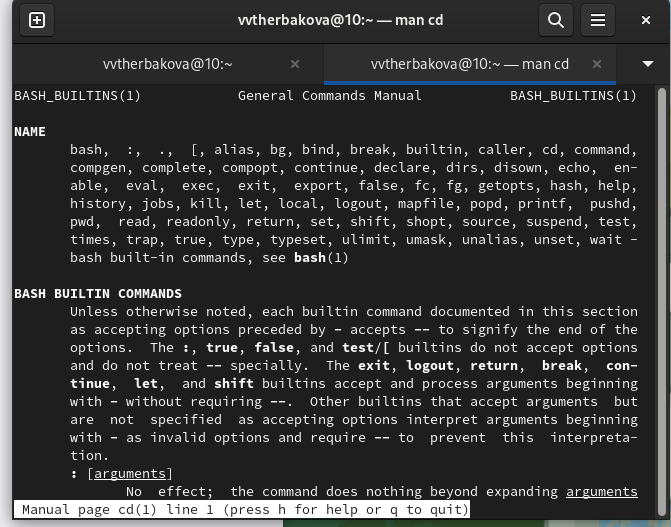{#fig:011 width=90%}
(рис. [-@fig:012])
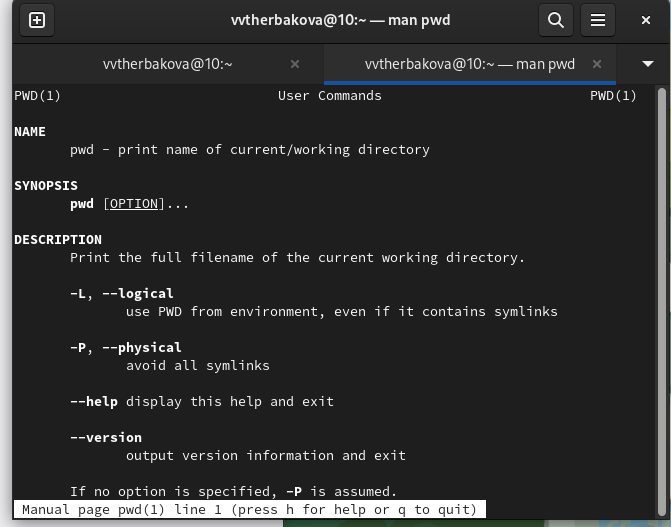{#fig:012 width=90%}
(рис. [-@fig:013])
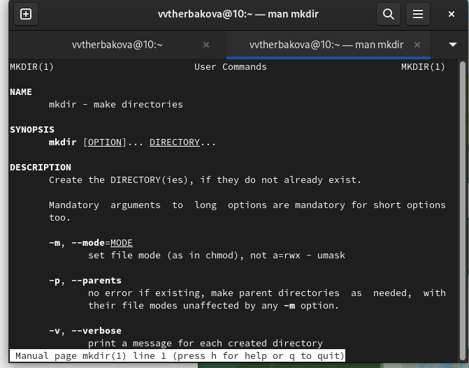{#fig:013 width=90%}
(рис. [-@fig:014])
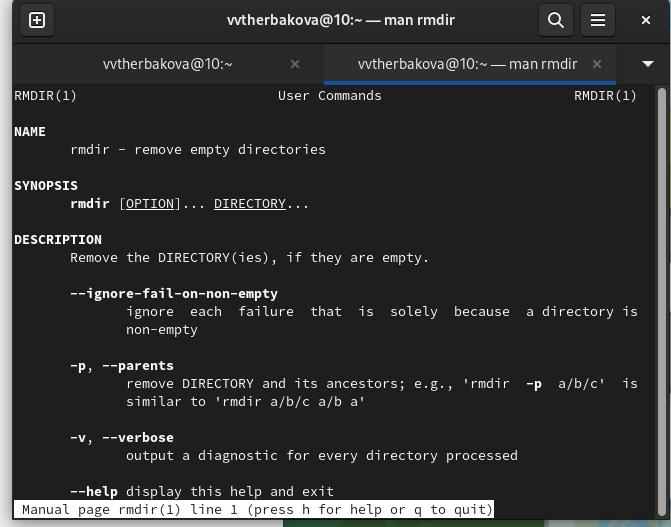{#fig:014 width=90%}
(рис. [-@fig:015])
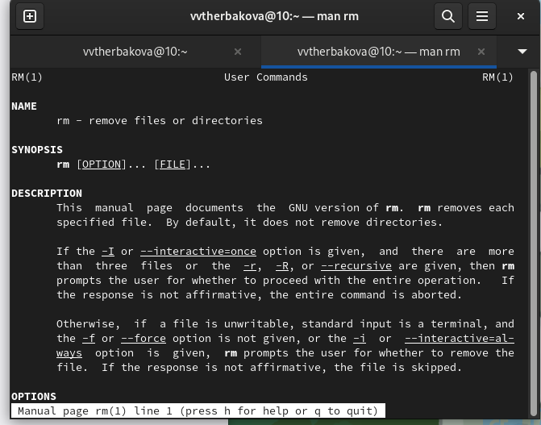{#fig:015 width=90%}
##
6. Используя информацию, полученную при помощи команды history, выполните мо-
дификацию и исполнение нескольких команд из буфера команд(рис. [-@fig:017])
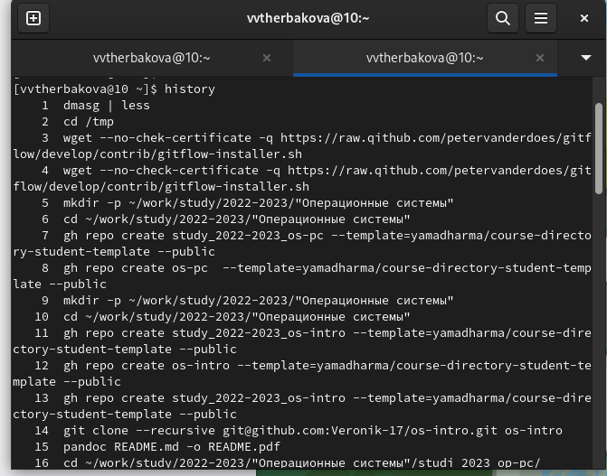{#fig:016 width=90%}
(рис. [-@fig:018])
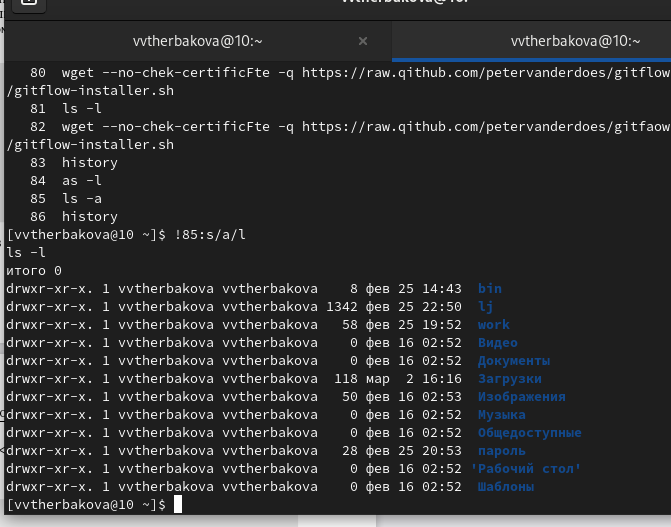{#fig:017 width=90%}


## Результаты
Приобрели практические навыки взаимодействия пользователя с системой по-
средством командной строки


## Итоговый слайд

Спасибо за внимание!!!


