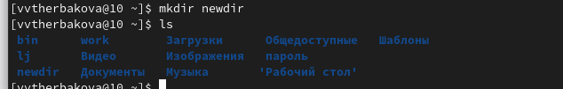

---
## Front matter
title: "Лабораторная работа №4"
subtitle: "Операционные системы"
author: "Щербакова Вероника Владимировна НБИбд-03-22"

## Generic otions
lang: ru-RU
toc-title: "Содержание"

## Bibliography
bibliography: bib/cite.bib
csl: pandoc/csl/gost-r-7-0-5-2008-numeric.csl

## Pdf output format
toc: true # Table of contents
toc-depth: 2
lof: true # List of figures
lot: true # List of tables
fontsize: 12pt
linestretch: 1.5
papersize: a4
documentclass: scrreprt
## I18n polyglossia
polyglossia-lang:
  name: russian
  options:
	- spelling=modern
	- babelshorthands=true
polyglossia-otherlangs:
  name: english
## I18n babel
babel-lang: russian
babel-otherlangs: english
## Fonts
mainfont: PT Serif
romanfont: PT Serif
sansfont: PT Sans
monofont: PT Mono
mainfontoptions: Ligatures=TeX
romanfontoptions: Ligatures=TeX
sansfontoptions: Ligatures=TeX,Scale=MatchLowercase
monofontoptions: Scale=MatchLowercase,Scale=0.9
## Biblatex
biblatex: true
biblio-style: "gost-numeric"
biblatexoptions:
  - parentracker=true
  - backend=biber
  - hyperref=auto
  - language=auto
  - autolang=other*
  - citestyle=gost-numeric
## Pandoc-crossref LaTeX customization
figureTitle: "Рис."
tableTitle: "Таблица"
listingTitle: "Листинг"
lofTitle: "Список иллюстраций"
lotTitle: "Список таблиц"
lolTitle: "Листинги"
## Misc options
indent: true
header-includes:
  - \usepackage{indentfirst}
  - \usepackage{float} # keep figures where there are in the text
  - \floatplacement{figure}{H} # keep figures where there are in the text
---

# Цель работы

Приобретение практических навыков взаимодействия пользователя с системой по-
средством командной строки

# Задание
# Теоретическое введение

# Выполнение лабораторной работы

1. Определите полное имя вашего домашнего каталога
{#fig:001 width=90%}

2. 1. Перейдите в каталог /tmp.тВыведите на экран содержимое каталога /tmp. Для этого используйте команду ls с различными опциями.
{#fig:002 width=90%}

    2. Определите, есть ли в каталоге /var/spool подкаталог с именем cron?(Нет)
{#fig:003 width=90%}

    3. Перейдите в Ваш домашний каталог и выведите на экран его содержимое. Опре-
делите, кто является владельцем файлов и подкаталогов? (Владельцем являюсь я, тк моя домашняя папка)
{#fig:004 width=90%}

3.  1. домашнем каталоге создайте новый каталог с именем newdir.+ проверка создания
{#fig:005 width=90%}

    2. В каталоге ~/newdir создайте новый каталог с именем morefun.
{#fig:006 width=90%}

    3. В домашнем каталоге создайте одной командой три новых каталога с именами
letters, memos, misk. Затем удалите эти каталоги одной командой.
{#fig:007 width=90%}

    4. Попробуйте удалить ранее созданный каталог ~/newdir командой rm. Проверьте,
был ли каталог удалён
{#fig:008 width=90%}

    5. Удалите каталог ~/newdir/morefun из домашнего каталога. Проверьте, был ли
каталог удалён.(Уже удален,тк удалили папку в которой он лежал)
{#fig:009 width=90%}

4. команды man
{#fig:010 width=90%}

5. Используйте команду man для просмотра описания следующих команд: cd, pwd, mkdir,
rmdir, rm. 
{#fig:011 width=90%}
{#fig:012 width=90%}
{#fig:013 width=90%}
{#fig:014 width=90%}
{#fig:015 width=90%}

6. Используя информацию, полученную при помощи команды history, выполните мо-
дификацию и исполнение нескольких команд из буфера команд
{#fig:016 width=90%}
{#fig:017 width=90%}

# Выводы

Приобрели практические навыки взаимодействия пользователя с системой по-
средством командной строки
# Список литературы{.unnumbered}

::: {#refs}
:::
