---
## Front matter
lang: ru-RU
title:лабораторная работа №5
subtitle: Операционные системы
  - Щербакова Вероника НБИбд-03-22
institute:
  - Российский университет дружбы народов, Москва, Россия
  
date: 6 марта 2023г.

## i18n babel
babel-lang: russian
babel-otherlangs: english

## Formatting pdf
toc: false
toc-title: Содержание
slide_level: 2
aspectratio: 169
section-titles: true
theme: metropolis
header-includes:
 - \metroset{progressbar=frametitle,sectionpage=progressbar,numbering=fraction}
 - '\makeatletter'
 - '\beamer@ignorenonframefalse'
 - '\makeatother'
---

# Информация

## Докладчик

:::::::::::::: {.columns align=center}
::: {.column width="70%"}

  * Щербакова Вероника Владимировна
  * ученица 1 курса
  * НБИбд-03-22
  * Российский университет дружбы народов
  * 
:::
::: {.column width="30%"}


:::
::::::::::::::

# Вводная часть

## Актуальность

## Объект и предмет исследования


## Цели и задачи
Ознакомление с файловой системой Linux, её структурой, именами и содержанием
каталогов. Приобретение практических навыков по применению команд для работы
с файлами и каталогами, по управлению процессами (и работами), по проверке исполь-
зования диска и обслуживанию файловой системы.


## Материалы и методы

- Процессор `pandoc` для входного формата Markdown
- Результирующие форматы
	- `pdf`
	- `html`
- Автоматизация процесса создания: `Makefile`

# Создание презентации

## Процессор `pandoc`

- Pandoc: преобразователь текстовых файлов
- Сайт: <https://pandoc.org/>
- Репозиторий: <https://github.com/jgm/pandoc>

## Формат `pdf`

- Использование LaTeX
- Пакет для презентации: [beamer](https://ctan.org/pkg/beamer)
- Тема оформления: `metropolis`

## Код для формата `pdf`

```yaml
slide_level: 2
aspectratio: 169
section-titles: true
theme: metropolis
```

## Формат `html`

- Используется фреймворк [reveal.js](https://revealjs.com/)
- Используется [тема](https://revealjs.com/themes/) `beige`

## Код для формата `html`

- Тема задаётся в файле `Makefile`

```make
REVEALJS_THEME = beige 
```
# Результаты

## Получающиеся форматы

- Полученный `pdf`-файл можно демонстрировать в любой программе просмотра `pdf`
- Полученный `html`-файл содержит в себе все ресурсы: изображения, css, скрипты

# Элементы презентации

## Актуальность

- Даёт понять, о чём пойдёт речь
- Следует широко и кратко описать проблему
- Мотивировать свое исследование
- Сформулировать цели и задачи
- Возможна формулировка ожидаемых результатов

## Цели и задачи

- Не формулируйте более 1--2 целей исследования

## Материалы и методы

- Представляйте данные качественно
- Количественно, только если крайне необходимо
- Излишние детали не нужны

## Содержание исследования

1. Выполните все примеры, приведённые в первой части описания лабораторной работы (рис.[-@fig:001])
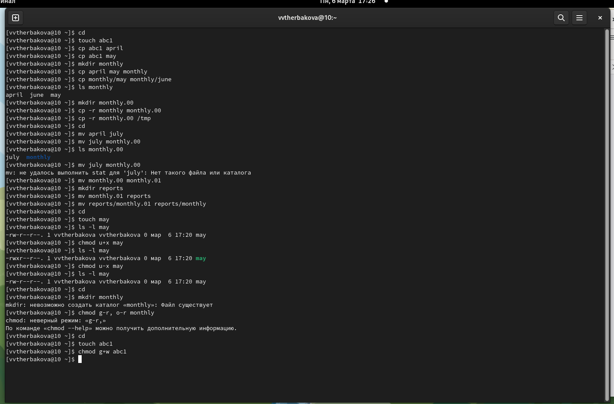{#fig:001 width=90%}

2.   1. Скопируйте файл /usr/include/sys/io.h в домашний каталог и назовите его equipment. (рис.[-@fig:002])
     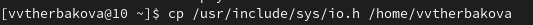{#fig:002 width=90%}
     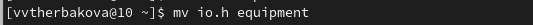{#fig:003 width=90%}
     2.  домашнем каталоге создайте директорию ~/ski.plases (рис.[-@fig:004])
     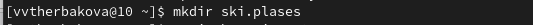{#fig:004 width=90%}
     3. Переместите файл equipment в каталог ~/ski.plases.(рис.[-@fig:005])
     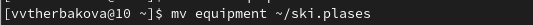{#fig:005 width=90%}
     4. Переименуйте файл ~/ski.plases/equipment в ~/ski.plases/equiplis(рис.[-@fig:006])
     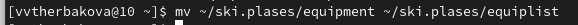{#fig:006 width=90%}  
     5. Создайте в домашнем каталоге файл abc1 и скопируйте его в каталог ~/ski.plases, назовите его equiplist2(рис.[-@fig:007])
     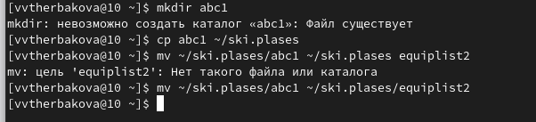{#fig:007 width=90%}
     6. Создайте каталог с именем equipment в каталоге ~/ski.plases:
     7. Переместите файлы ~/ski.plases/equiplist и equiplist2 в каталог ~/ski.plases/equipment:
     8. Создайте и переместите каталог ~/newdir в каталог ~/ski.plases и назовите его plans:(рис.[-@fig:008])
     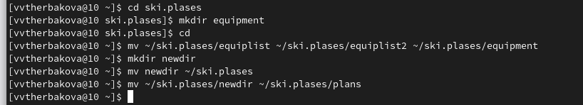{#fig:008 width=90%}
      
3. Определите опции команды chmod, необходимые для того, чтобы присвоить перечис-
ленным ниже файлам выделенные права доступа, считая, что в начале таких прав
нет
    1. drwxr--r-- ... australia и drwx--x--x ... play(рис.[-@fig:009])
    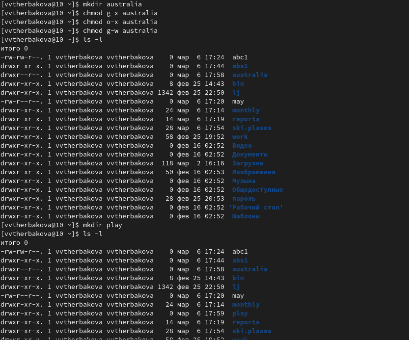{#fig:009 width=90%}
    2. -r-xr--r-- ... my_os(рис.[-@fig:010])
    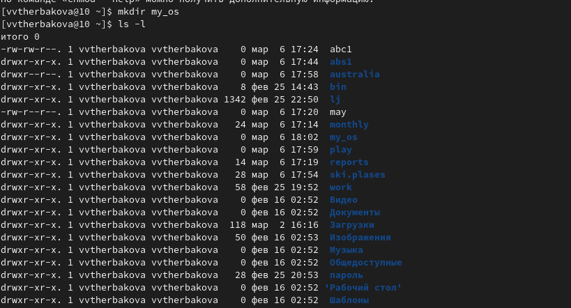{#fig:010 width=90%}
    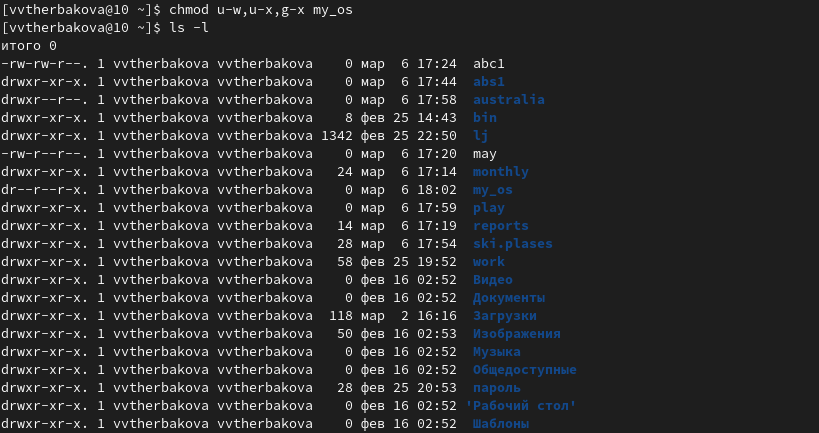{#fig:011 width=90%}
    3. -rw-rw-r-- ... feathers(рис.[-@fig:012])
    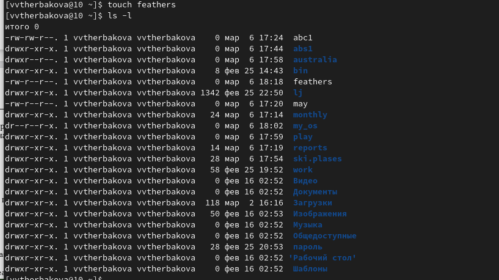{#fig:012 width=90%}
      
4. Проделайте приведённые ниже упражнения, записывая в отчёт по лабораторной работе используемые при этом команды
      1. росмотрите содержимое файла /etc/password(Данного файла нет)
      2.копируйте файл ~/feathers в файл ~/file.old.
      3. Переместите файл ~/file.old в каталог ~/play.
      4. Скопируйте каталог ~/play в каталог ~/fun.
      5. Переместите каталог ~/fun в каталог ~/play и назовите его games.
      6. Лишите владельца файла ~/feathers права на чтение.
      7. Что произойдёт, если вы попытаетесь просмотреть файл ~/feathers командой cat?
      8. Что произойдёт, если вы попытаетесь скопировать файл ~/feathers?
      9. Дайте владельцу файла ~/feathers право на чтение.
      10. Лишите владельца каталога ~/play права на выполнение.
      11. Перейдите в каталог ~/play. Что произошло?
      12. Дайте владельцу каталога ~/play право на выполнение.(рис.[-@fig:013])
      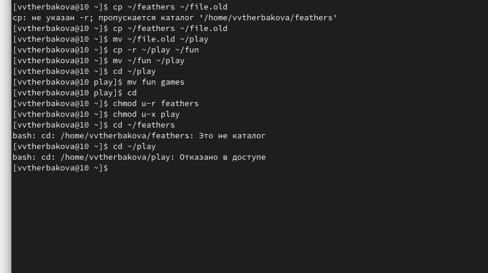{#fig:013 width=90%}
5. Прочитайте man по командам mount, fsck, mkfs, kill(рис.[-@fig:014])
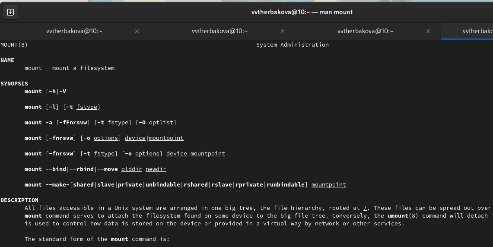{#fig:014 width=90%}
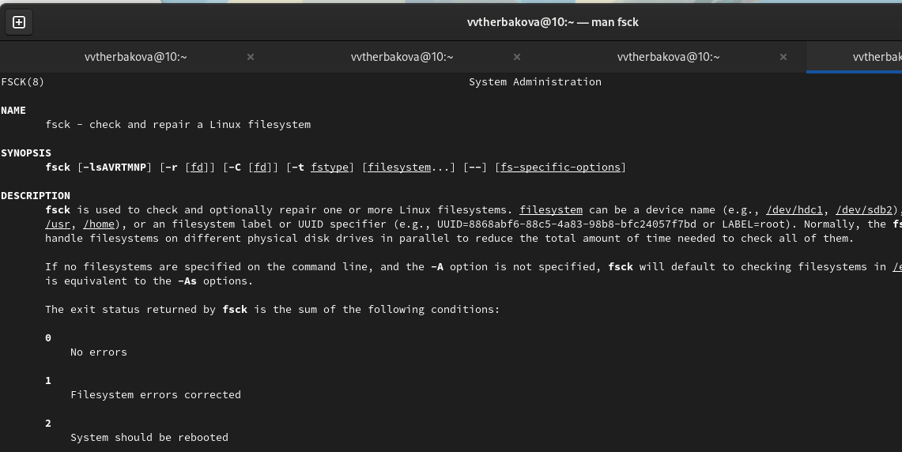{#fig:015 width=90%}
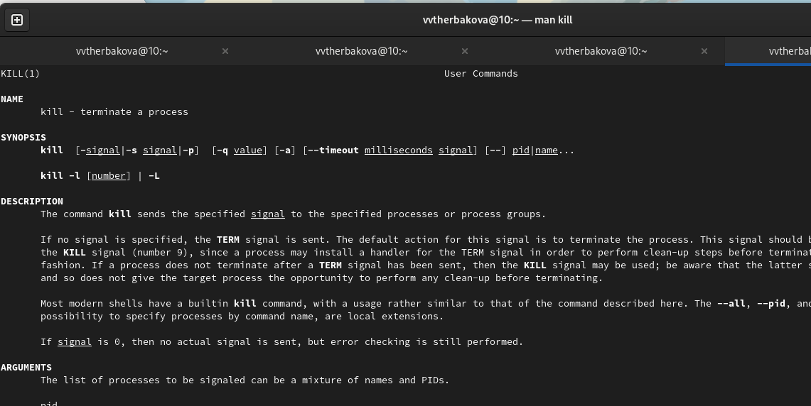{#fig:016 width=90%}

## Результаты
Ознакомились с файловой системой Linux, её структурой, именами и содержанием
каталогов


## Итоговый слайд

Спасибо за внимание


:::

