---
## Front matter
title: "Лабораторная работа №5"
subtitle: "Операционные системы"
author: "Щербакова Вероника Владимировна НБИбд-03-22"

## Generic otions
lang: ru-RU
toc-title: "Содержание"

## Bibliography
bibliography: bib/cite.bib
csl: pandoc/csl/gost-r-7-0-5-2008-numeric.csl

## Pdf output format
toc: true # Table of contents
toc-depth: 2
lof: true # List of figures
lot: true # List of tables
fontsize: 12pt
linestretch: 1.5
papersize: a4
documentclass: scrreprt
## I18n polyglossia
polyglossia-lang:
  name: russian
  options:
	- spelling=modern
	- babelshorthands=true
polyglossia-otherlangs:
  name: english
## I18n babel
babel-lang: russian
babel-otherlangs: english
## Fonts
mainfont: PT Serif
romanfont: PT Serif
sansfont: PT Sans
monofont: PT Mono
mainfontoptions: Ligatures=TeX
romanfontoptions: Ligatures=TeX
sansfontoptions: Ligatures=TeX,Scale=MatchLowercase
monofontoptions: Scale=MatchLowercase,Scale=0.9
## Biblatex
biblatex: true
biblio-style: "gost-numeric"
biblatexoptions:
  - parentracker=true
  - backend=biber
  - hyperref=auto
  - language=auto
  - autolang=other*
  - citestyle=gost-numeric
## Pandoc-crossref LaTeX customization
figureTitle: "Рис."
tableTitle: "Таблица"
listingTitle: "Листинг"
lofTitle: "Список иллюстраций"
lotTitle: "Список таблиц"
lolTitle: "Листинги"
## Misc options
indent: true
header-includes:
  - \usepackage{indentfirst}
  - \usepackage{float} # keep figures where there are in the text
  - \floatplacement{figure}{H} # keep figures where there are in the text
---

# Цель работы
Ознакомление с файловой системой Linux, её структурой, именами и содержанием
каталогов. Приобретение практических навыков по применению команд для работы
с файлами и каталогами, по управлению процессами (и работами), по проверке исполь-
зования диска и обслуживанию файловой системы

# Задание
# Теоретическое введение
# Выполнение лабораторной работы

1. Выполните все примеры, приведённые в первой части описания лабораторной работы
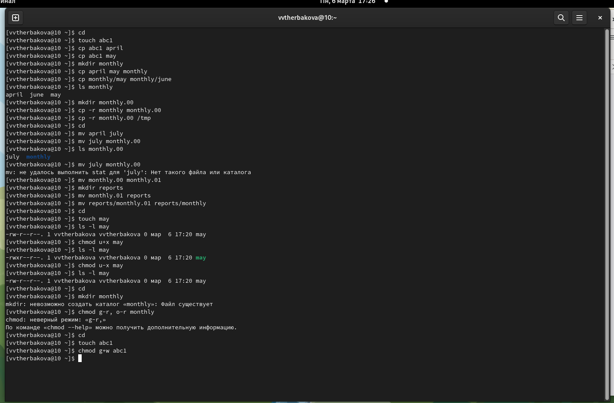{#fig:001 width=90%}

2.   1. Скопируйте файл /usr/include/sys/io.h в домашний каталог и назовите его equipment. 
     {#fig:002 width=90%}
     {#fig:003 width=90%}
     2.  домашнем каталоге создайте директорию ~/ski.plases
     {#fig:004 width=90%}
     3. Переместите файл equipment в каталог ~/ski.plases.
     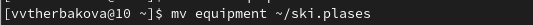{#fig:005 width=90%}
     4. Переименуйте файл ~/ski.plases/equipment в ~/ski.plases/equiplis
     {#fig:006 width=90%}  
     5. Создайте в домашнем каталоге файл abc1 и скопируйте его в каталог ~/ski.plases, назовите его equiplist2
     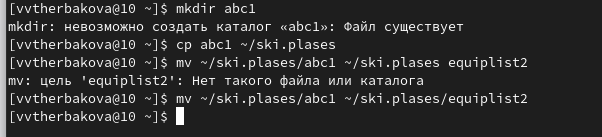{#fig:007 width=90%}
     6. Создайте каталог с именем equipment в каталоге ~/ski.plases:
     7. Переместите файлы ~/ski.plases/equiplist и equiplist2 в каталог ~/ski.plases/equipment:
     8. Создайте и переместите каталог ~/newdir в каталог ~/ski.plases и назовите его plans:
     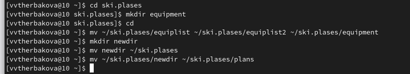{#fig:008 width=90%}
      
3. Определите опции команды chmod, необходимые для того, чтобы присвоить перечис-
ленным ниже файлам выделенные права доступа, считая, что в начале таких прав
нет
    1. drwxr--r-- ... australia и drwx--x--x ... play
    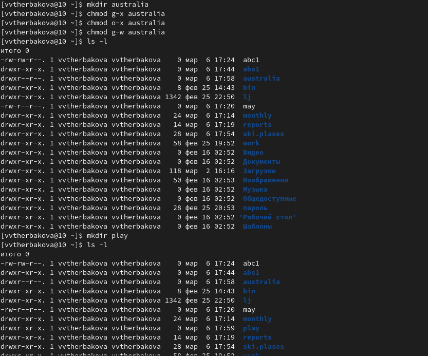{#fig:009 width=90%}
    2. -r-xr--r-- ... my_os
    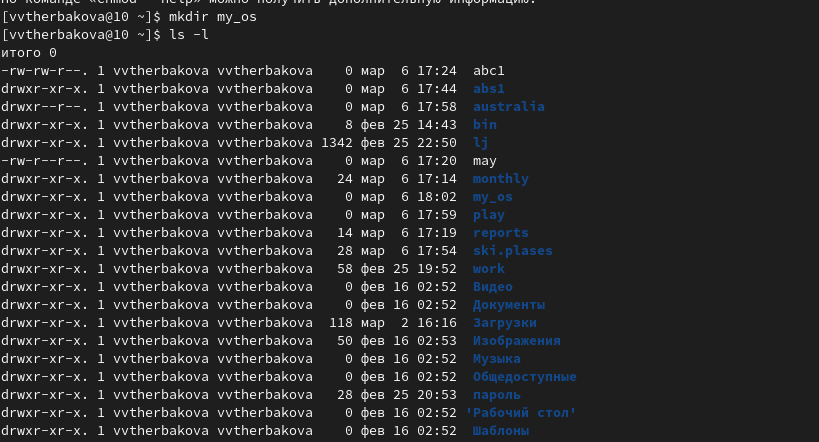{#fig:010 width=90%}
    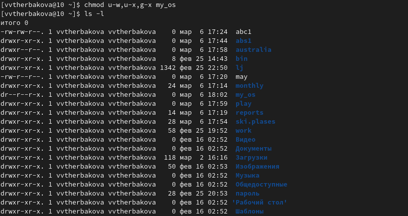{#fig:011 width=90%}
    3. -rw-rw-r-- ... feathers
    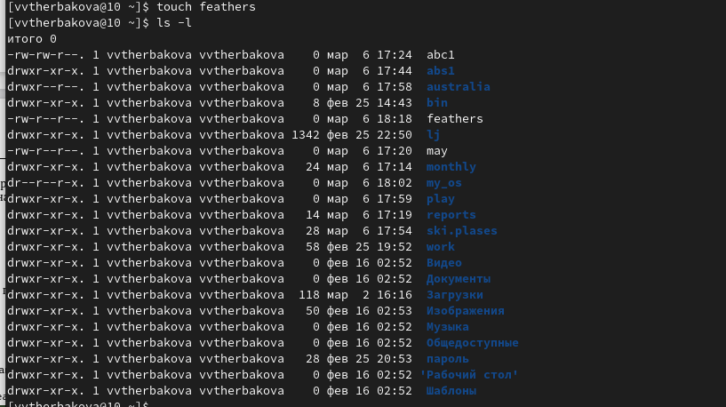{#fig:012 width=90%}
      
4. Проделайте приведённые ниже упражнения, записывая в отчёт по лабораторной работе используемые при этом команды
      1. росмотрите содержимое файла /etc/password(Данного файла нет)
      2.копируйте файл ~/feathers в файл ~/file.old.
      3. Переместите файл ~/file.old в каталог ~/play.
      4. Скопируйте каталог ~/play в каталог ~/fun.
      5. Переместите каталог ~/fun в каталог ~/play и назовите его games.
      6. Лишите владельца файла ~/feathers права на чтение.
      7. Что произойдёт, если вы попытаетесь просмотреть файл ~/feathers командой cat?
      8. Что произойдёт, если вы попытаетесь скопировать файл ~/feathers?
      9. Дайте владельцу файла ~/feathers право на чтение.
      10. Лишите владельца каталога ~/play права на выполнение.
      11. Перейдите в каталог ~/play. Что произошло?
      12. Дайте владельцу каталога ~/play право на выполнение.
      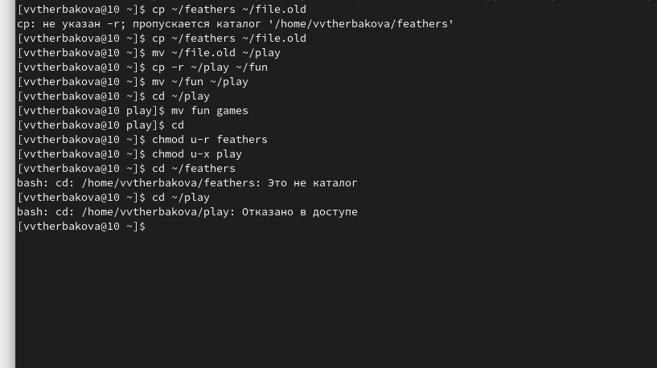{#fig:013 width=90%}
5. Прочитайте man по командам mount, fsck, mkfs, kill
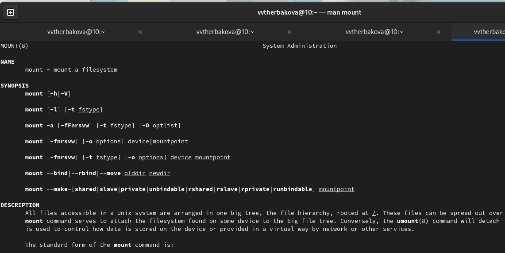{#fig:014 width=90%}
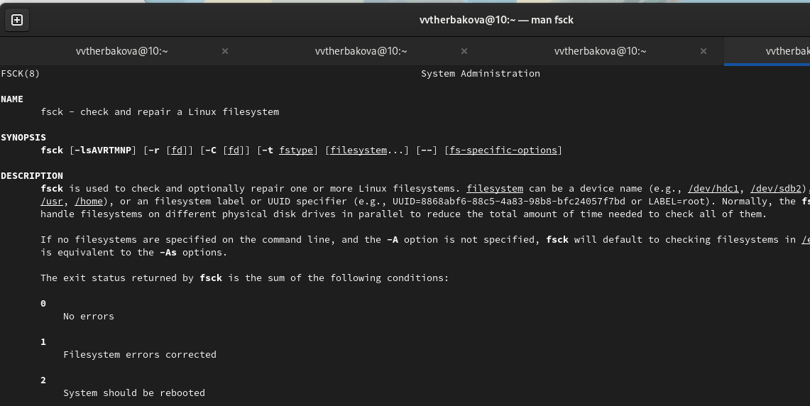{#fig:015 width=90%}
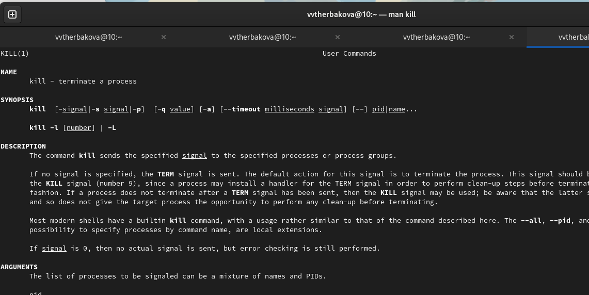{#fig:016 width=90%}
      

# Выводы

Ознакомились с файловой системой Linux, её структурой, именами и содержанием
каталогов

# Список литературы{.unnumbered}

::: {#refs}
:::
