---
## Front matter
lang: ru-RU
title: Лабораторная работа №6
subtitle: Операционные системы
author:
  - Щербакова В.В.
institute:
  - Российский университет дружбы народов, Москва, Россия
  - Объединённый институт ядерных исследований, Дубна, Россия
date: 16 марта 2023

## i18n babel
babel-lang: russian
babel-otherlangs: english

## Formatting pdf
toc: false
toc-title: Содержание
slide_level: 2
aspectratio: 169
section-titles: true
theme: metropolis
header-includes:
 - \metroset{progressbar=frametitle,sectionpage=progressbar,numbering=fraction}
 - '\makeatletter'
 - '\beamer@ignorenonframefalse'
 - '\makeatother'
---

# Информация

## Докладчик

:::::::::::::: {.columns align=center}
::: {.column width="70%"}

  * Щербакова Вероника Владимировна
  * студентка 1-го курса
  * Бизнесс-Информатика
  * Российский университет дружбы народов
 

:::
::: {.column width="30%"}

:::
::::::::::::::

# Вводная часть

## Актуальность

- Для тех, кто хочет научиться управлять процессами (и заданиями), по
проверке использования диска и обслуживанию файловых систем


## Цели и задачи

- Ознакомление с инструментами поиска файлов и фильтрации текстовых данных.

## Материалы и методы

- Процессор `pandoc` для входного формата Markdown
- Результирующие форматы
	- `pdf`
	- `html`
- Автоматизация процесса создания: `Makefile`

# Создание презентации

## Процессор `pandoc`

- Pandoc: преобразователь текстовых файлов
- Сайт: <https://pandoc.org/>
- Репозиторий: <https://github.com/jgm/pandoc>

## Формат `pdf`

- Использование LaTeX
- Пакет для презентации: [beamer](https://ctan.org/pkg/beamer)
- Тема оформления: `metropolis`

## Код для формата `pdf`

```yaml
slide_level: 2
aspectratio: 169
section-titles: true
theme: metropolis
```

## Формат `html`

- Используется фреймворк [reveal.js](https://revealjs.com/)
- Используется [тема](https://revealjs.com/themes/) `beige`

## Код для формата `html`

- Тема задаётся в файле `Makefile`

```make
REVEALJS_THEME = beige 
```
# Результаты

## Получающиеся форматы

- Полученный `pdf`-файл можно демонстрировать в любой программе просмотра `pdf`
- Полученный `html`-файл содержит в себе все ресурсы: изображения, css, скрипты


## Содержание исследования

1. Осуществите вход в систему, используя соответствующее имя пользователя(уже зашли в систему под именем пользователя)
2. Запишите в файл file.txt названия файлов, содержащихся в каталоге /etc. Допи-
шите в этот же файл названия файлов, содержащихся в вашем домашнем каталоге.
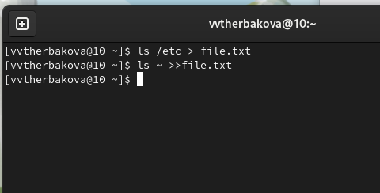{#fig:001 width=90%}
3.  1. Выведите имена всех файлов из file.txt, имеющих расширение .conf
    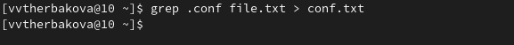{#fig:002 width=90%}
    2. Запишите их в новый текстовой файл conf.txt.
    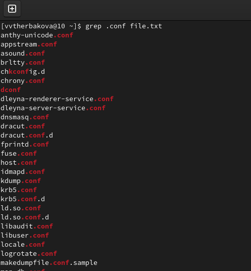{#fig:003 width=90%}
4. Определите, какие файлы в вашем домашнем каталоге имеют имена, начинавшиеся
с символа c? 
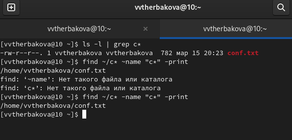{#fig:004 width=90%}
5. Выведите на экран (по странично) имена файлов из каталога /etc, начинающиеся
с символа h.
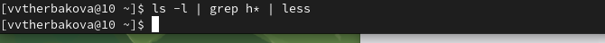{#fig:005 width=90%}
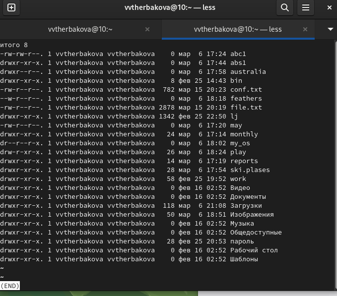{#fig:006 width=90%}
6. Запустите в фоновом режиме процесс, который будет записывать в файл ~/logfile
файлы, имена которых начинаются с log. Удалите файл ~/logfile
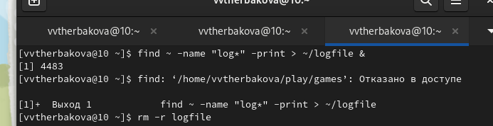{#fig:007 width=90%}
7. Запустите из консоли в фоновом режиме редактор gedit.Прочтите справку (man) команды kill, после чего используйте её для завершения процесса gedit
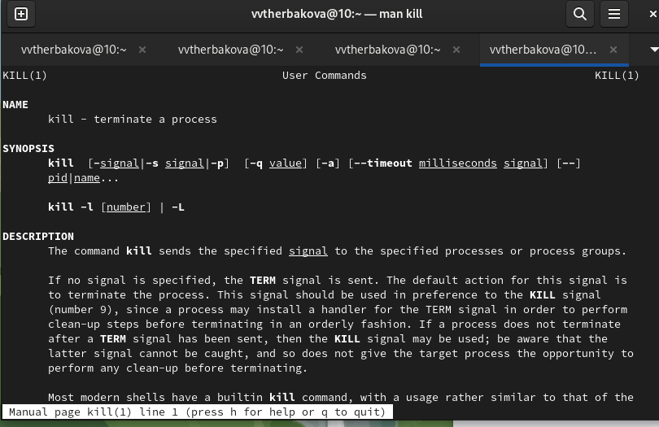{#fig:008 width=90%}
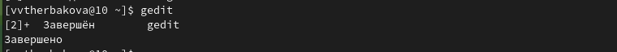{#fig:009 width=90%}
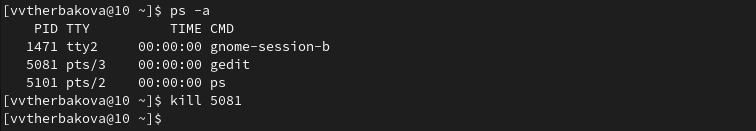{#fig:010 width=90%}
8. Определите идентификатор процесса gedit, используя команду ps, конвейер и фильтр grep
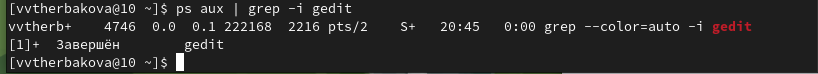{#fig:011 width=90%}
9. Выполните команды df и du, предварительно получив более подробную информацию
об этих командах, с помощью команды man
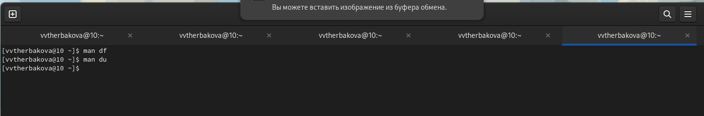{#fig:012 width=90%}
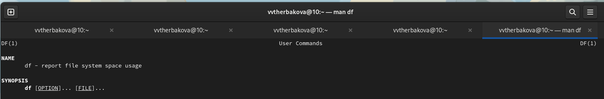{#fig:013 width=90%}
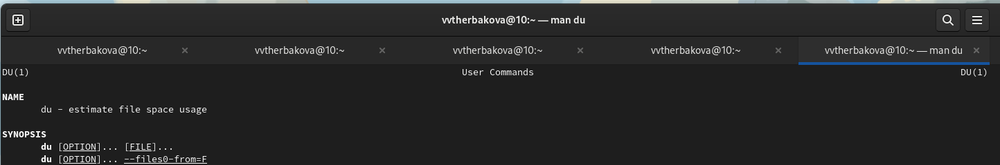{#fig:014 width=90%}
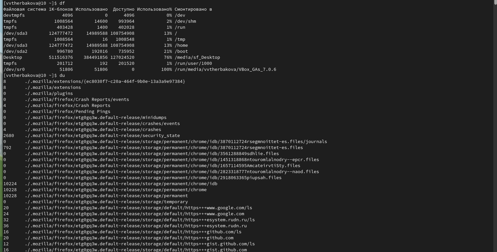{#fig:015 width=90%}
10. Воспользовавшись справкой команды find, выведите имена всех директорий, имею-
щихся в вашем домашнем каталоге.
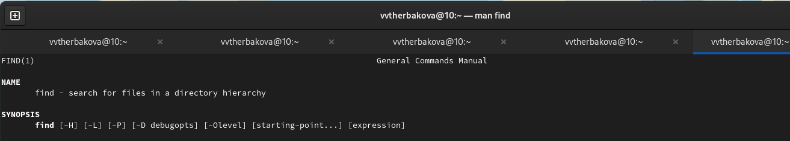{#fig:016 width=90%}
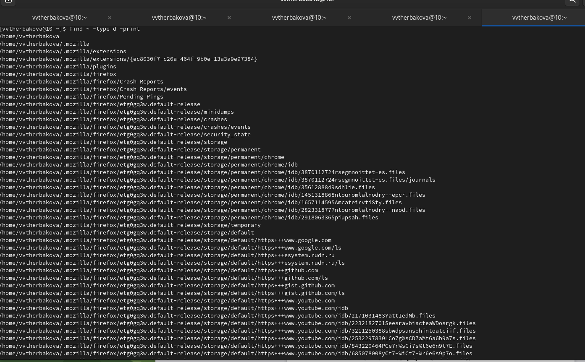{#fig:017 width=90%}

## Результаты

- Ознакомились с инструментами поиска файлов и фильтрации текстовых данных. Приобрели практические навыки: по управлению процессами (и заданиями), по проверке использования диска и обслуживанию файловых систем.


## Итоговый слайд

- Спасибо за внимание


:::

