---
## Front matter
lang: ru-RU
title: Лабораторная работа №7
subtitle: Презентация
author:
  - Щербакова В.В.
institute:
  - Российский университет дружбы народов, Москва, Россия
 
date: 25 марта 2023 г.

## i18n babel
babel-lang: russian
babel-otherlangs: english

## Formatting pdf
toc: false
toc-title: Содержание
slide_level: 2
aspectratio: 169
section-titles: true
theme: metropolis
header-includes:
 - \metroset{progressbar=frametitle,sectionpage=progressbar,numbering=fraction}
 - '\makeatletter'
 - '\beamer@ignorenonframefalse'
 - '\makeatother'
---

# Информация

## Докладчик

:::::::::::::: {.columns align=center}
::: {.column width="70%"}

  * Щербакова Вероника Владимировна
  * НБИбд-03-22
  * Студентка 1-го курса
  * Российский университет дружбы народов
  

:::
::: {.column width="30%"}

:::
::::::::::::::

# Вводная часть

## Актуальность
Для тех, кто хочет преобрести практические навыки в  Midnight Commander.

## Цели и задачи
Освоение основных возможностей командной оболочки Midnight Commander. Приоб-
ретение навыков практической работы по просмотру каталогов и файлов; манипуляций
с ними


## Материалы и методы

- Процессор `pandoc` для входного формата Markdown
- Результирующие форматы
	- `pdf`
	- `html`
- Автоматизация процесса создания: `Makefile`

# Создание презентации

## Процессор `pandoc`

- Pandoc: преобразователь текстовых файлов
- Сайт: <https://pandoc.org/>
- Репозиторий: <https://github.com/jgm/pandoc>

## Формат `pdf`

- Использование LaTeX
- Пакет для презентации: [beamer](https://ctan.org/pkg/beamer)
- Тема оформления: `metropolis`

## Код для формата `pdf`

```yaml
slide_level: 2
aspectratio: 169
section-titles: true
theme: metropolis
```

## Формат `html`

- Используется фреймворк [reveal.js](https://revealjs.com/)
- Используется [тема](https://revealjs.com/themes/) `beige`

## Код для формата `html`

- Тема задаётся в файле `Makefile`

```make
REVEALJS_THEME = beige 
```
# Результаты

## Получающиеся форматы

- Полученный `pdf`-файл можно демонстрировать в любой программе просмотра `pdf`
- Полученный `html`-файл содержит в себе все ресурсы: изображения, css, скрипты

## Содержание исследования
1. Изучите информацию о mc, вызвав в командной строке man mс
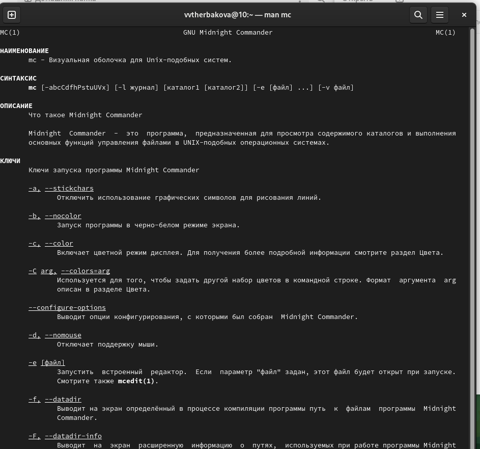{#fig:001 width=90%}
2. Используя возможности подменю Файл , выполните:
    1. просмотр содержимого текстового файла
   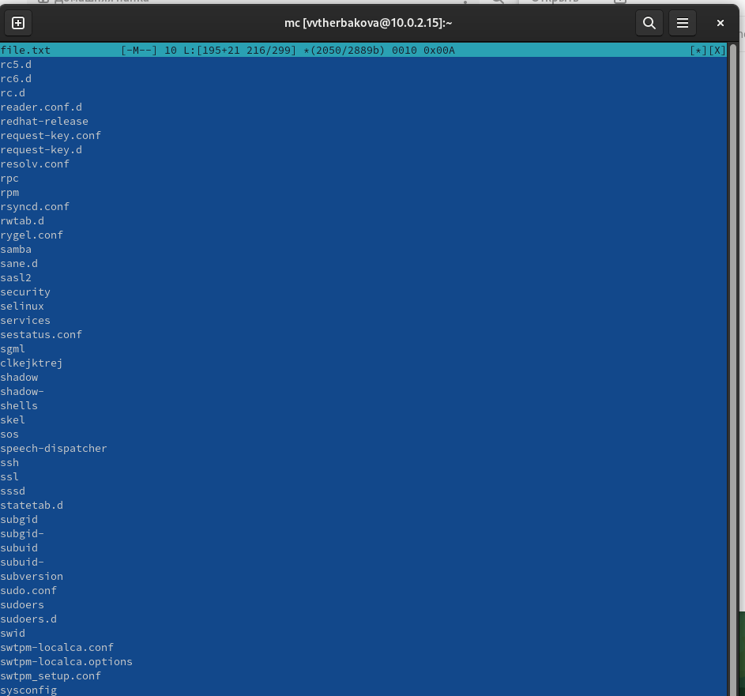{#fig:002 width=90%}
    2. создание каталога;копирование в файлов в созданный каталог
    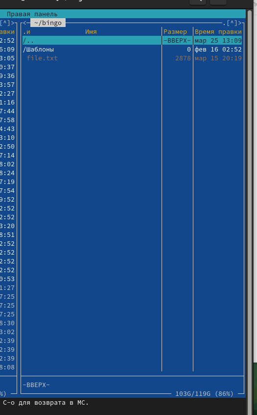{#fig:003 width=90%}
3.  Спомощью соответствующих средств подменю Команда осуществите:
    1.  поиск в файловой системе файла с заданными условиями (например, файла с расширением .c или .cpp, содержащего строку main);
    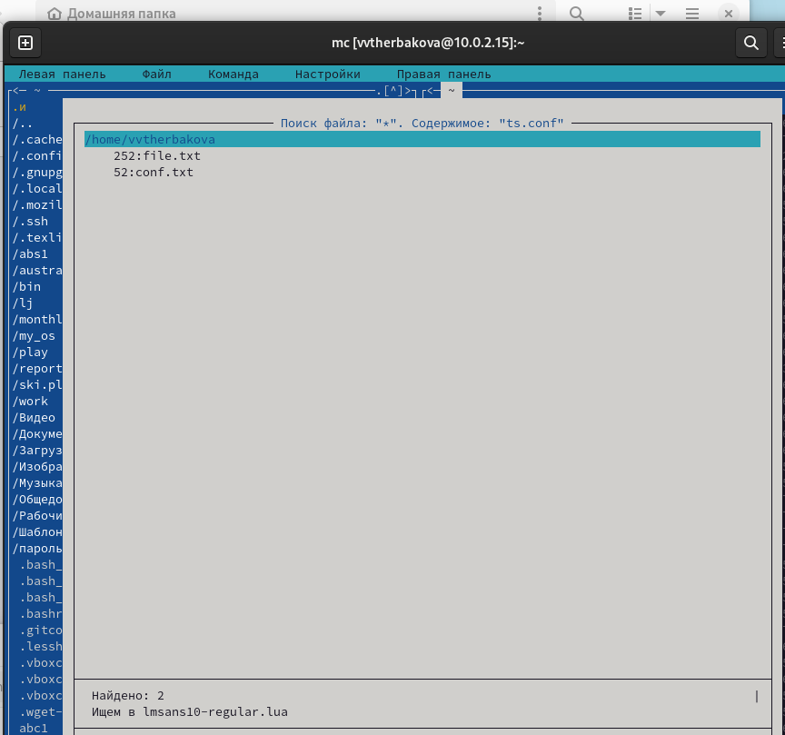{#fig:004 width=90%}
    2. выбор и повторение одной из предыдущих команд;
    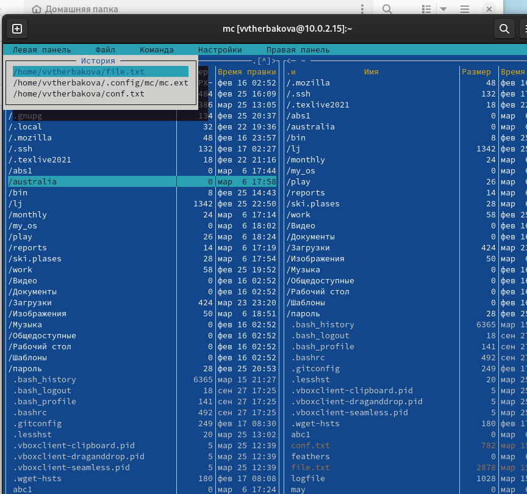{#fig:005 width=90%}
    3. переход в домашний каталог;
    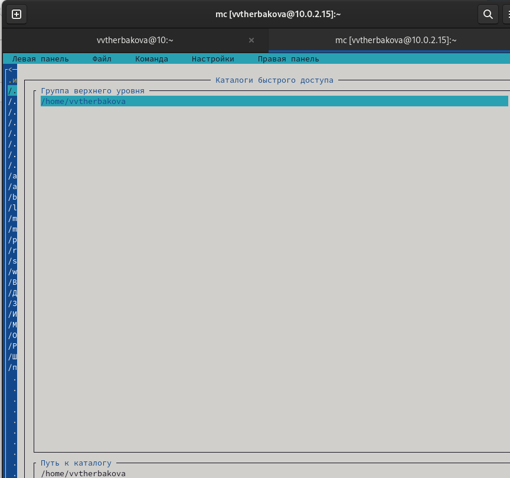{#fig:006 width=90%}
    4. анализ файла меню и файла расширений
    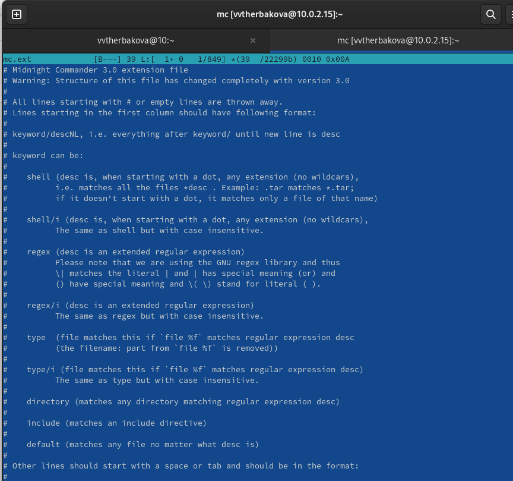{#fig:007 width=90%}
    5. Удаление каталога 
    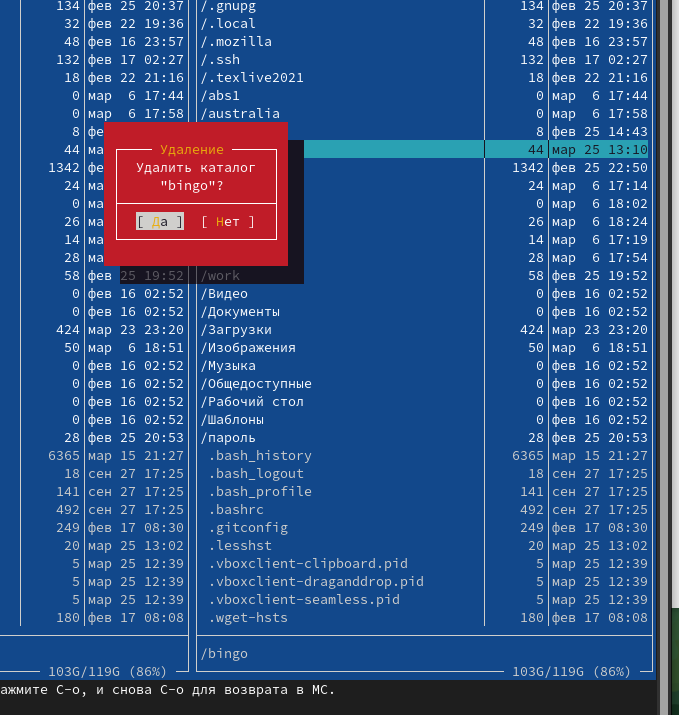{#fig:008 width=90%}
4. Создайте текстовой файл text.txt
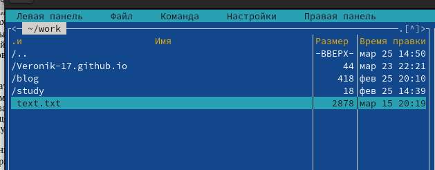{#fig:009 width=90%}
5. ткройте этот файл с помощью встроенного в mc редактора. Вставьте в открытый файл небольшой фрагмент текста,скопированный из любого другого файла из интернета.
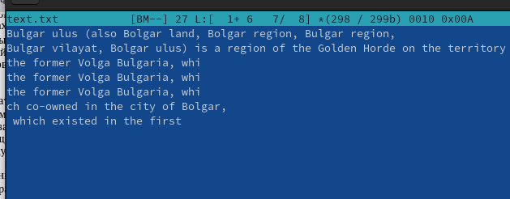{#fig:010 width=90%}
6.  Проделайте с текстом следующие манипуляции, используя горячие клавиши: Удалите строку текста.Выделите фрагмент текста и скопируйте его на новую строку.Выделите фрагмент текста и перенесите его на новую строку. Отмените последнее действие. Перейдите в конец файла (нажав комбинацию клавиш) и напишите некоторыйтекст.Перейдите в начало файла (нажав комбинацию клавиш) и напишите некоторыйтекст. Сохраните и закройте файл
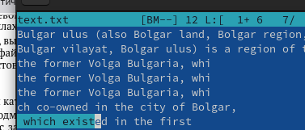{#fig:011 width=90%}
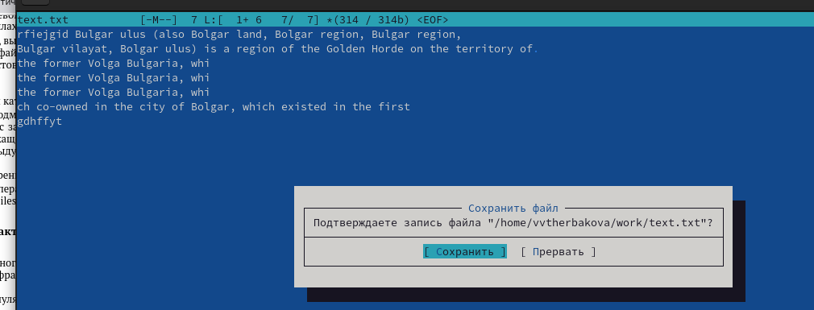{#fig:012 width=90%}
7. Откройте файл с исходным текстом на некотором языке программирования
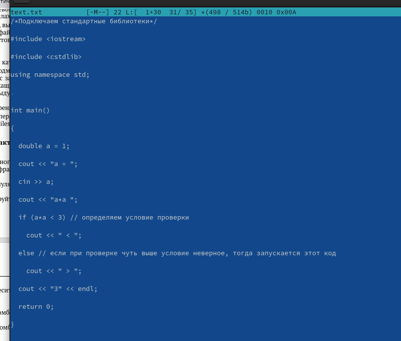{#fig:013 width=90%}
8. Используя меню редактора, включите подсветку синтаксиса, если она не включена,
или выключите, если она включена
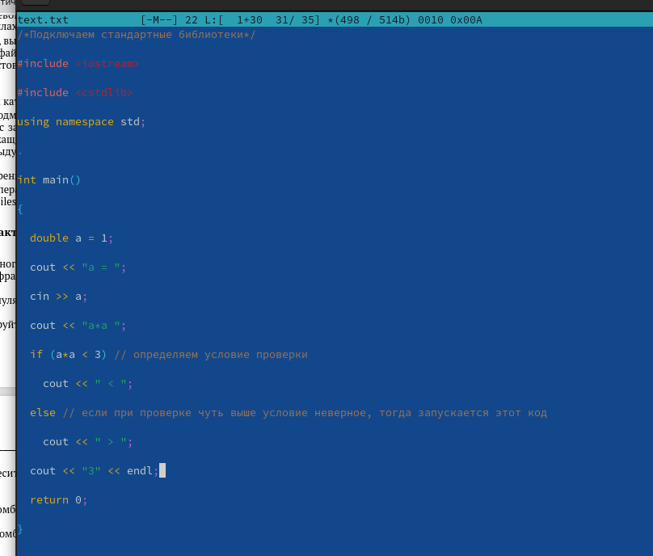{#fig:014 width=90%}

## Итоговый слайд

Освоили основные возможности командной оболочки Midnight Commander. Приоб-
рели навыки практической работы по просмотру каталогов и файлов; манипуляций
с ними.
# Рекомендации

## Принцип 10/20/30

  - 10 слайдов
  - 20 минут на доклад
  - 30 кегль шрифта

## Связь слайдов

::: incremental

- Один слайд --- одна мысль
- Нельзя ссылаться на объекты, находящиеся на предыдущих слайдах (например, на формулы)
- Каждый слайд должен иметь заголовок

:::

## Количество сущностей

::: incremental

- Человек может одновременно помнить $7 \pm 2$ элемента
- При размещении информации на слайде старайтесь чтобы в сумме слайд содержал не более 5 элементов
- Можно группировать элементы так, чтобы визуально было не более 5 групп

:::

## Общие рекомендации

::: incremental

- На слайд выносится та информация, которая без зрительной опоры воспринимается хуже
- Слайды должны дополнять или обобщать содержание выступления или его частей, а не дублировать его
- Информация на слайдах должна быть изложена кратко, чётко и хорошо структурирована
- Слайд не должен быть перегружен графическими изображениями и текстом
- Не злоупотребляйте анимацией и переходами

:::

## Представление данных

::: incremental

- Лучше представить в виде схемы
- Менее оптимально представить в виде рисунка, графика, таблицы
- Текст используется, если все предыдущие способы отображения информации не подошли

:::

