---
## Front matter
title: "Отчет по лабораторной работе №7"
subtitle: "Операционные системы"
author: "Щербакова Вероника НБИбд-03-22"

## Generic otions
lang: ru-RU
toc-title: "Содержание"

## Bibliography
bibliography: bib/cite.bib
csl: pandoc/csl/gost-r-7-0-5-2008-numeric.csl

## Pdf output format
toc: true # Table of contents
toc-depth: 2
lof: true # List of figures
lot: true # List of tables
fontsize: 12pt
linestretch: 1.5
papersize: a4
documentclass: scrreprt
## I18n polyglossia
polyglossia-lang:
  name: russian
  options:
	- spelling=modern
	- babelshorthands=true
polyglossia-otherlangs:
  name: english
## I18n babel
babel-lang: russian
babel-otherlangs: english
## Fonts
mainfont: PT Serif
romanfont: PT Serif
sansfont: PT Sans
monofont: PT Mono
mainfontoptions: Ligatures=TeX
romanfontoptions: Ligatures=TeX
sansfontoptions: Ligatures=TeX,Scale=MatchLowercase
monofontoptions: Scale=MatchLowercase,Scale=0.9
## Biblatex
biblatex: true
biblio-style: "gost-numeric"
biblatexoptions:
  - parentracker=true
  - backend=biber
  - hyperref=auto
  - language=auto
  - autolang=other*
  - citestyle=gost-numeric
## Pandoc-crossref LaTeX customization
figureTitle: "Рис."
tableTitle: "Таблица"
listingTitle: "Листинг"
lofTitle: "Список иллюстраций"
lotTitle: "Список таблиц"
lolTitle: "Листинги"
## Misc options
indent: true
header-includes:
  - \usepackage{indentfirst}
  - \usepackage{float} # keep figures where there are in the text
  - \floatplacement{figure}{H} # keep figures where there are in the text
---

# Цель работы
Освоение основных возможностей командной оболочки Midnight Commander. Приоб-
ретение навыков практической работы по просмотру каталогов и файлов; манипуляций
с ними

# Выполнение лабораторной работы

1. Изучите информацию о mc, вызвав в командной строке man mс
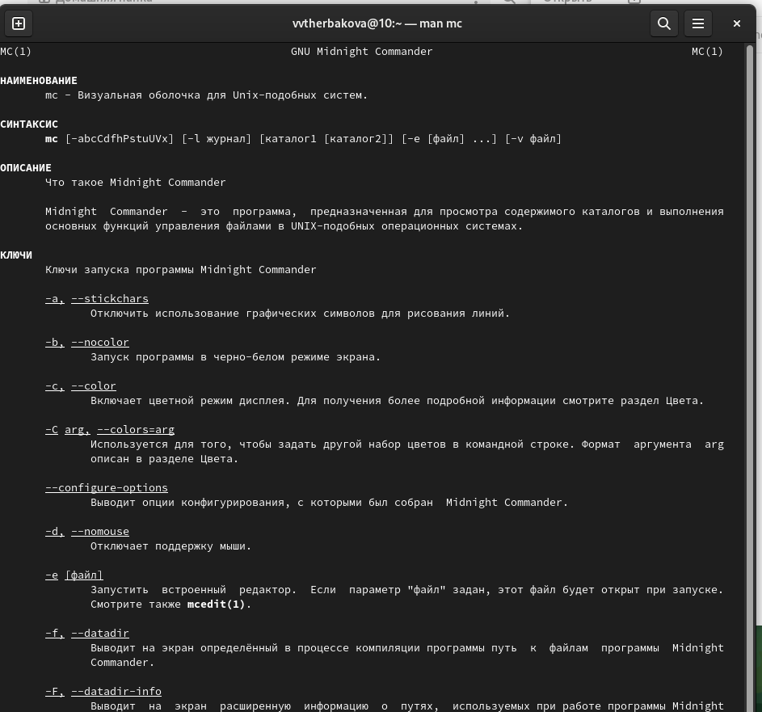{#fig:001 width=90%}
2. Используя возможности подменю Файл , выполните:
    1. просмотр содержимого текстового файла
   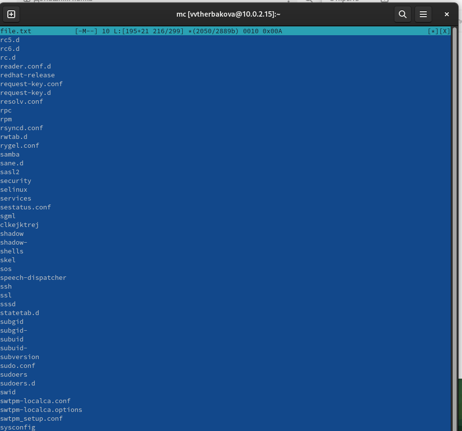{#fig:002 width=90%}
    2. создание каталога;копирование в файлов в созданный каталог
    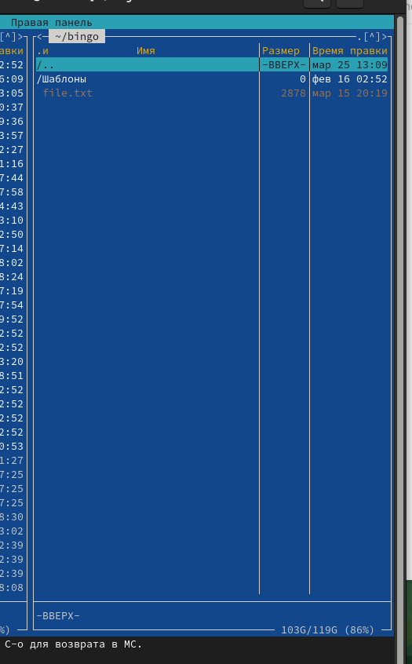{#fig:003 width=90%}
3.  Спомощью соответствующих средств подменю Команда осуществите:
    1.  поиск в файловой системе файла с заданными условиями (например, файла с расширением .c или .cpp, содержащего строку main);
    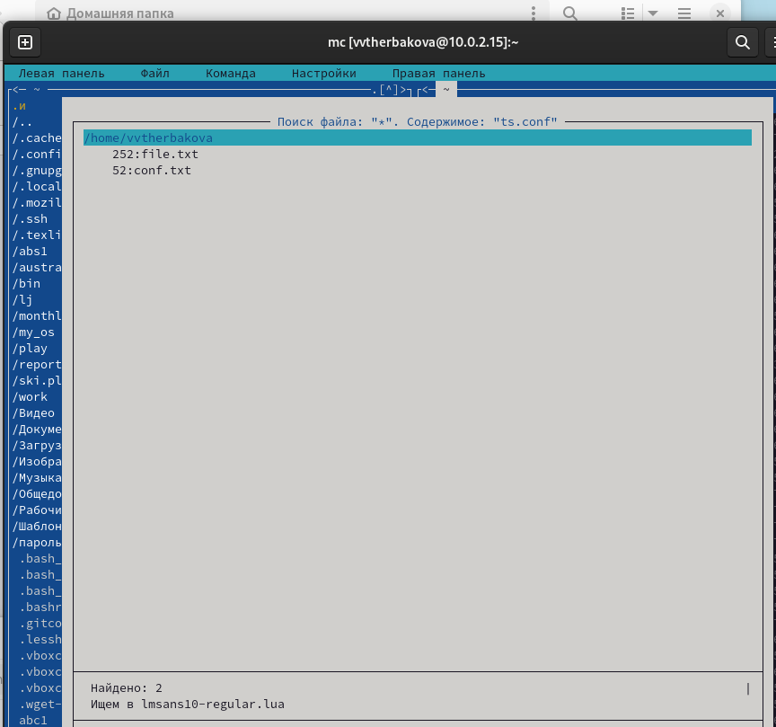{#fig:004 width=90%}
    2. выбор и повторение одной из предыдущих команд;
    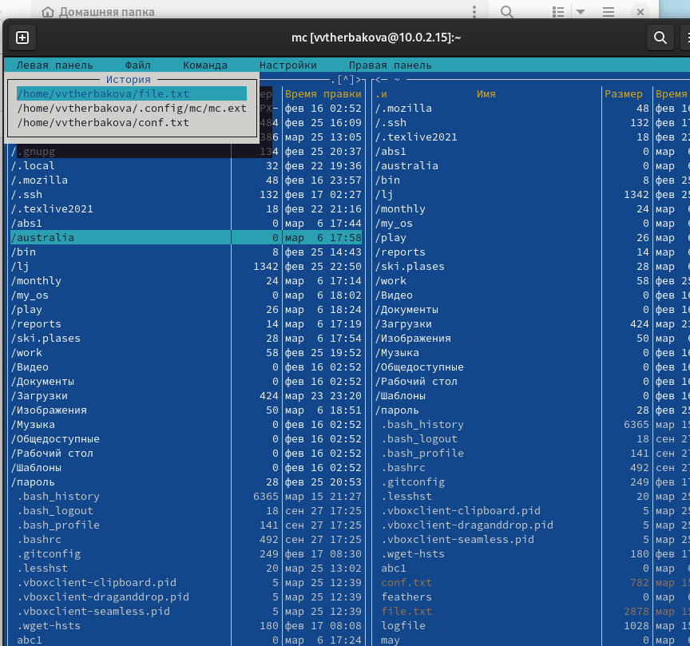{#fig:005 width=90%}
    3. переход в домашний каталог;
    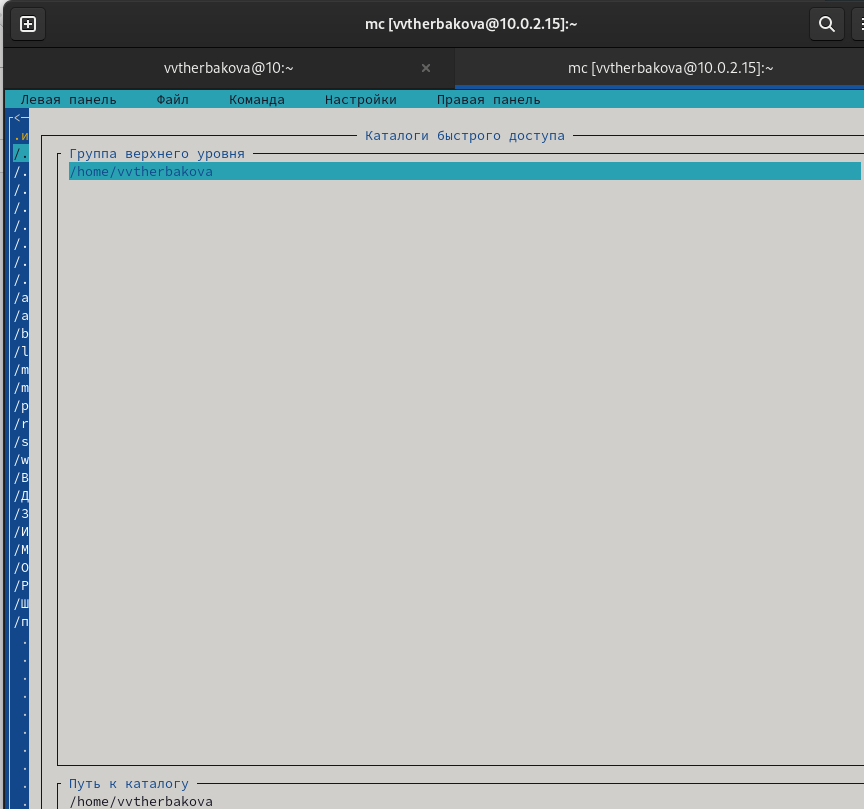{#fig:006 width=90%}
    4. анализ файла меню и файла расширений
    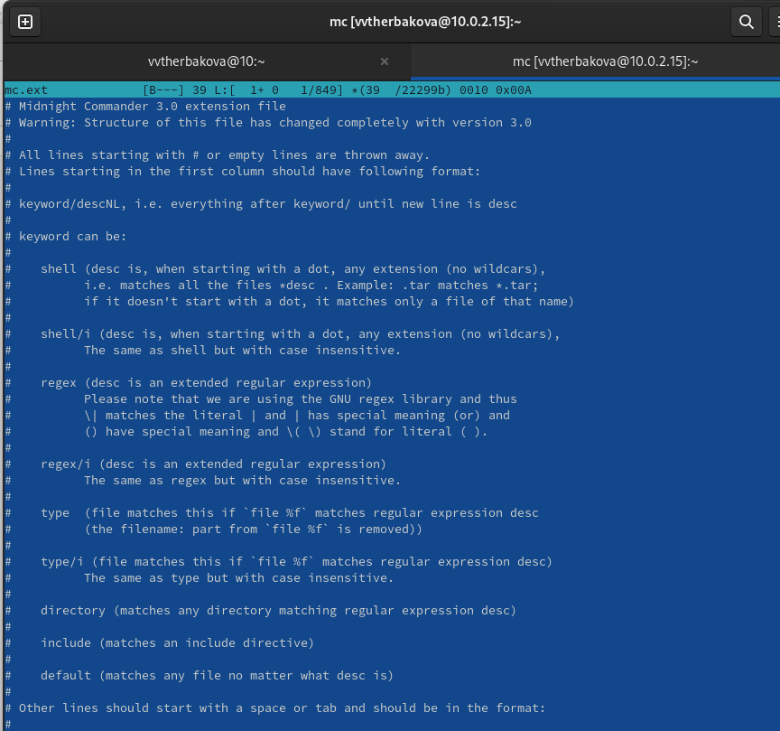{#fig:007 width=90%}
    5. Удаление каталога 
    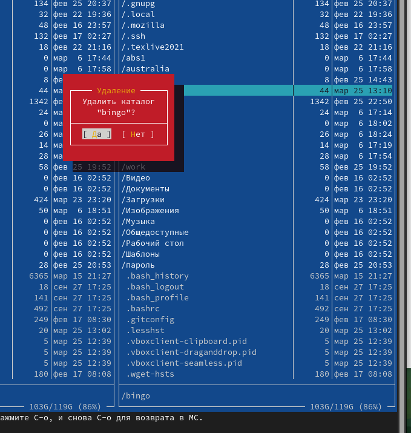{#fig:008 width=90%}
4. Создайте текстовой файл text.txt
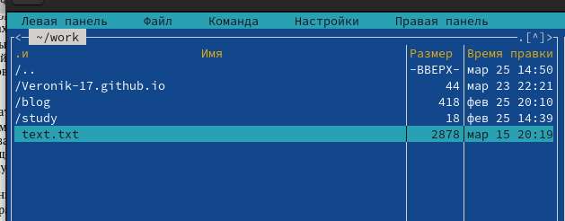{#fig:009 width=90%}
5. ткройте этот файл с помощью встроенного в mc редактора. Вставьте в открытый файл небольшой фрагмент текста,скопированный из любого другого файла из интернета.
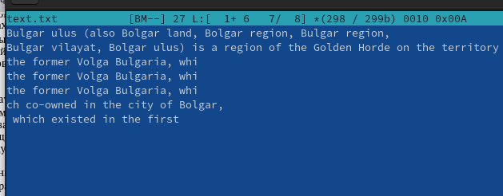{#fig:010 width=90%}
6.  Проделайте с текстом следующие манипуляции, используя горячие клавиши: Удалите строку текста.Выделите фрагмент текста и скопируйте его на новую строку.Выделите фрагмент текста и перенесите его на новую строку. Отмените последнее действие. Перейдите в конец файла (нажав комбинацию клавиш) и напишите некоторыйтекст.Перейдите в начало файла (нажав комбинацию клавиш) и напишите некоторыйтекст. Сохраните и закройте файл
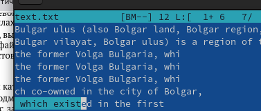{#fig:011 width=90%}
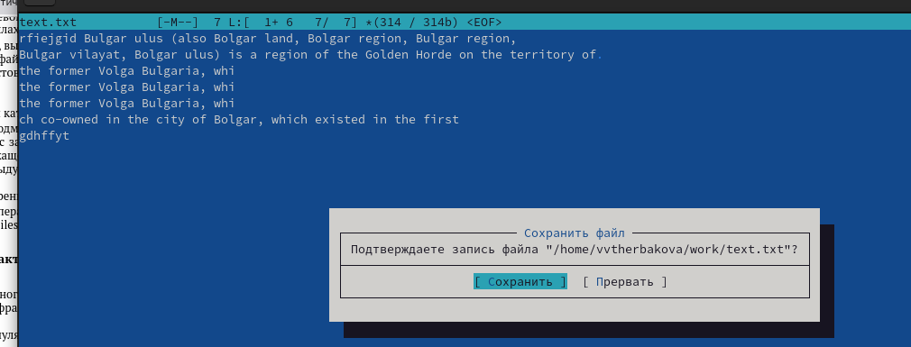{#fig:012 width=90%}
7. Откройте файл с исходным текстом на некотором языке программирования
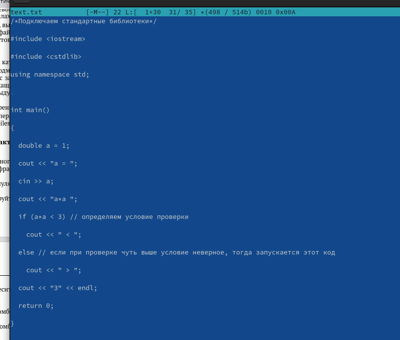{#fig:013 width=90%}
8. Используя меню редактора, включите подсветку синтаксиса, если она не включена,
или выключите, если она включена
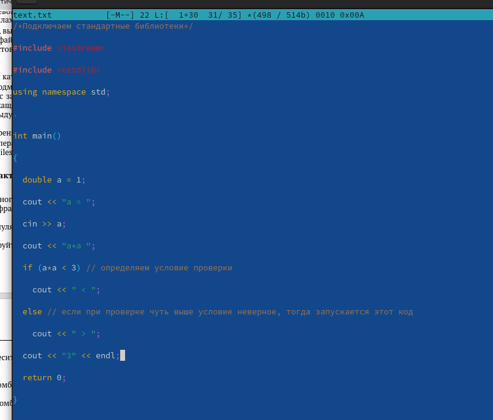{#fig:014 width=90%}

# Выводы
Освоили основные возможности командной оболочки Midnight Commander. Приоб-
рели навыки практической работы по просмотру каталогов и файлов; манипуляций
с ними.

# Список литературы{.unnumbered}

::: {#refs}
:::
