---
## Front matter
lang: ru-RU
title: Отчет по лабораторной работе №8
subtitle: Операционные системы
author:
  - Щеррррбакова В.В
institute:
  - Российский университет дружбы народов, Москва, Россия
  - 
date: 01 апреля 2023

## i18n babel
babel-lang: russian
babel-otherlangs: english

## Formatting pdf
toc: false
toc-title: Содержание
slide_level: 2
aspectratio: 169
section-titles: true
theme: metropolis
header-includes:
 - \metroset{progressbar=frametitle,sectionpage=progressbar,numbering=fraction}
 - '\makeatletter'
 - '\beamer@ignorenonframefalse'
 - '\makeatother'
---

# Информация

## Докладчик

:::::::::::::: {.columns align=center}
::: {.column width="70%"}

  * Щербакова Вероника Владимировна
  * учиица 1-го курса НБИбд-03-22
  * Российский университет дружбы народов

:::
::: {.column width="30%"}

:::
::::::::::::::

# Вводная часть

## Актуальность

- для тез кто не умеет пользоваться редактором viiii

## Цели и задачи

- Познакомиться с операционной системой Linux. Получить практические навыки рабо-
ты с редактором vi, установленным по умолчанию практически во всех дистрибутивах

## Материалы и методы

- Процессор `pandoc` для входного формата Markdown
- Результирующие форматы
	- `pdf`
	- `html`
- Автоматизация процесса создания: `Makefile`

# Создание презентации

## Процессор `pandoc`

- Pandoc: преобразователь текстовых файлов
- Сайт: <https://pandoc.org/>
- Репозиторий: <https://github.com/jgm/pandoc>

## Формат `pdf`

- Использование LaTeX
- Пакет для презентации: [beamer](https://ctan.org/pkg/beamer)
- Тема оформления: `metropolis`

## Код для формата `pdf`

```yaml
slide_level: 2
aspectratio: 169
section-titles: true
theme: metropolis
```

## Формат `html`

- Используется фреймворк [reveal.js](https://revealjs.com/)
- Используется [тема](https://revealjs.com/themes/) `beige`

## Код для формата `html`

- Тема задаётся в файле `Makefile`

```make
REVEALJS_THEME = beige 
```
# Результаты

## Получающиеся форматы

- Полученный `pdf`-файл можно демонстрировать в любой программе просмотра `pdf`
- Полученный `html`-файл содержит в себе все ресурсы: изображения, css, скрипты

# Элементы презентации

## Актуальность

- Даёт понять, о чём пойдёт речь
- Следует широко и кратко описать проблему
- Мотивировать свое исследование
- Сформулировать цели и задачи
- Возможна формулировка ожидаемых результатов

## Цели и задачи

- Не формулируйте более 1--2 целей исследования

## Содержание исследования
1. Создайте каталог с именем ~/work/os/lab06.Перейдите во вновь созданный каталог
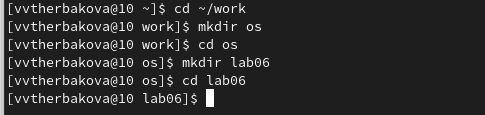{#fig:001 width=90%}

2. Вызовите vi и создайте файл hello.sh
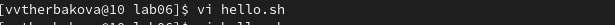{#fig:002 width=90%}

3. Нажмите клавишу i и вводите следующий текст
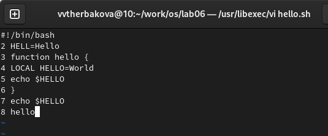{#fig:003 width=90%}

4. Нажмите клавишу Esc для перехода в командный режим после завершения ввода
текста. Нажмите : для перехода в режим последней строки и внизу вашего экрана появится
приглашение в виде двоеточия.Нажмите w (записать) и q (выйти), а затем нажмите клавишу Enter для сохранения
вашего текста и завершения работы.
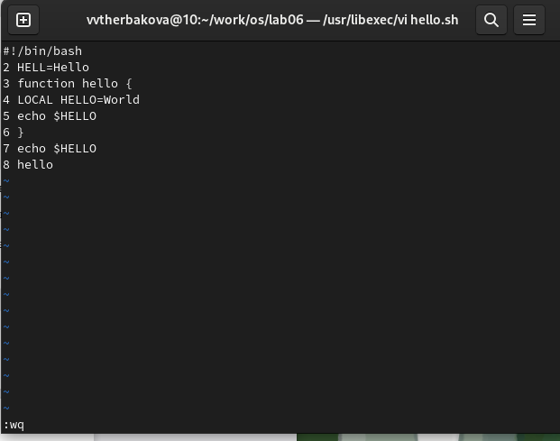{#fig:004 width=90%}

5. Сделайте файл исполняемым
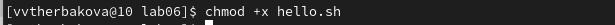{#fig:005 width=90%}

6. Вызовите vi на редактирование файла
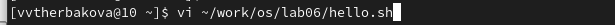{#fig:006 width=90%}

7. Установите курсор в конец слова HELL второй строки.
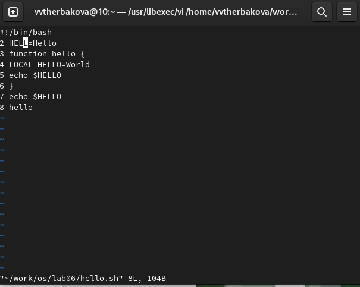{#fig:007 width=90%}

8. Перейдите в режим вставки и замените на HELLO. Нажмите Esc для возврата в команд-
ный режим
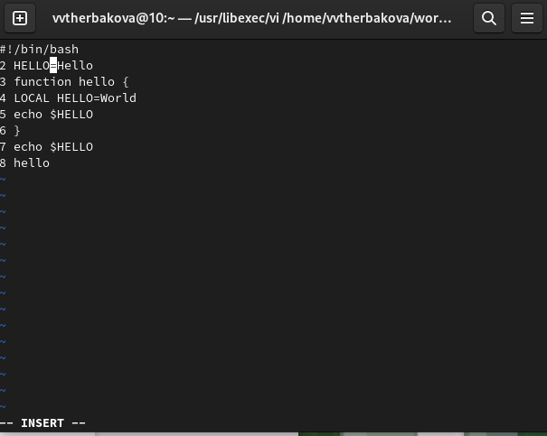{#fig:008 width=90%}

9. Установите курсор на четвертую строку и сотрите слово LOCAL
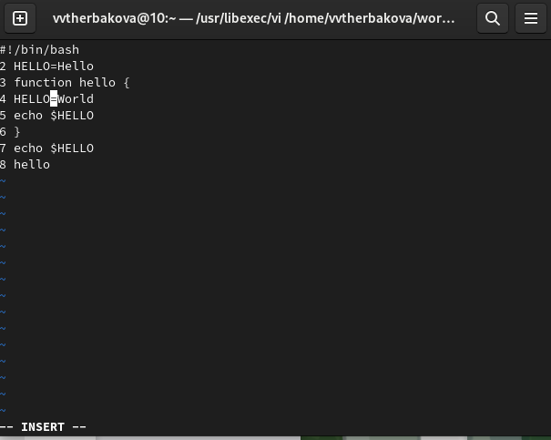{#fig:009 width=90%}

10. Перейдите в режим вставки и наберите следующий текст: local, нажмите Esc для
возврата в командный режим.
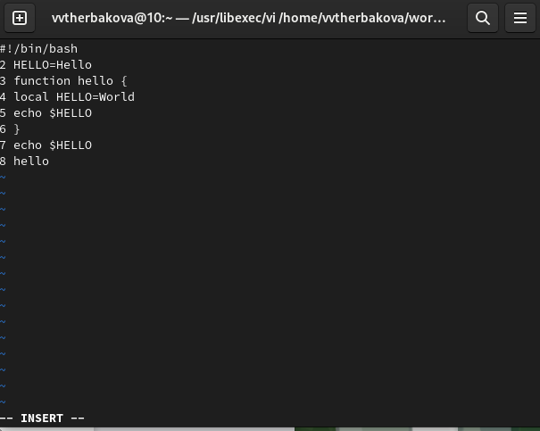{#fig:010 width=90%}

11. Установите курсор на последней строке файла. Вставьте после неё строку, содержащую
следующий текст: echo $HELLO.
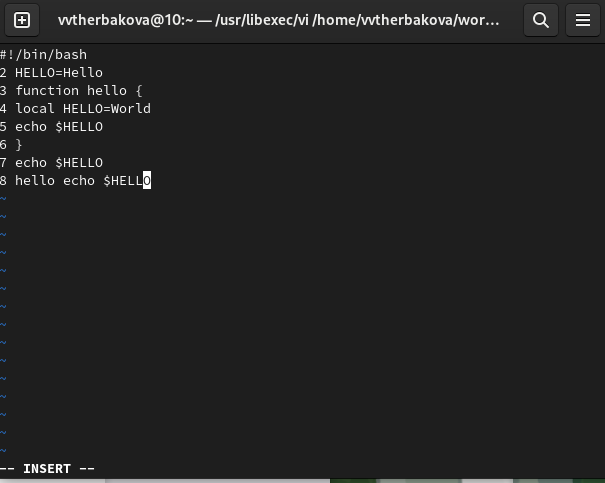{#fig:011 width=90%}

12. Удалите последнюю строку.
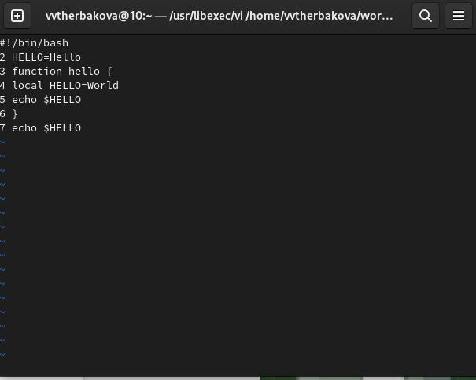{#fig:012 width=90%}

13. Введите команду отмены изменений u для отмены последней кома
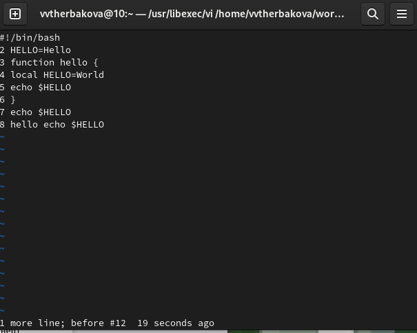{#fig:013 width=90%}


## Итоговый слайд

- Познакомились с операционной системой Linux. Получили практические навыки рабо-
ты с редактором vi, установленным по умолчанию практически во всех дистрибутивах


:::

