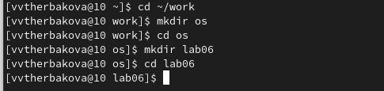
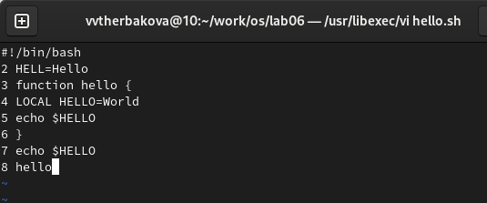
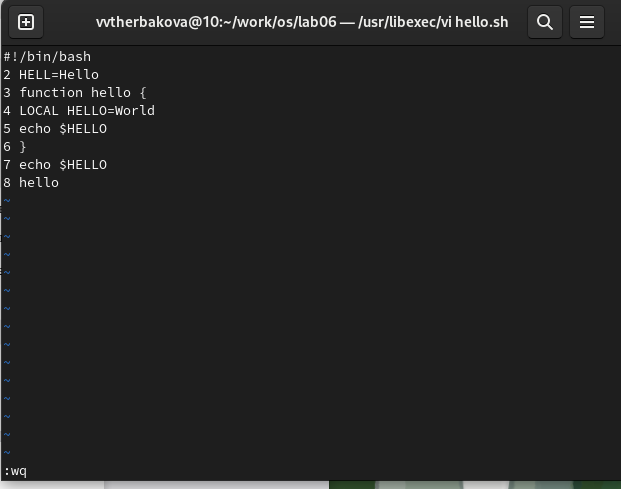
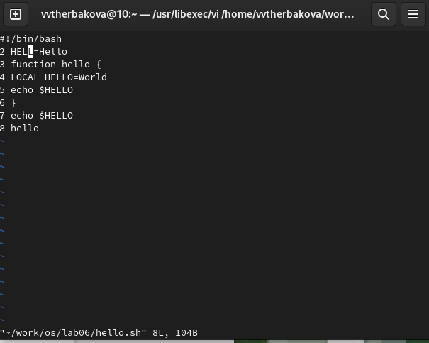
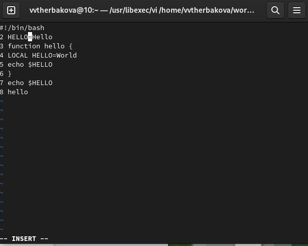
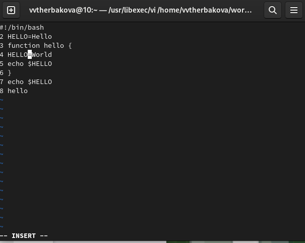
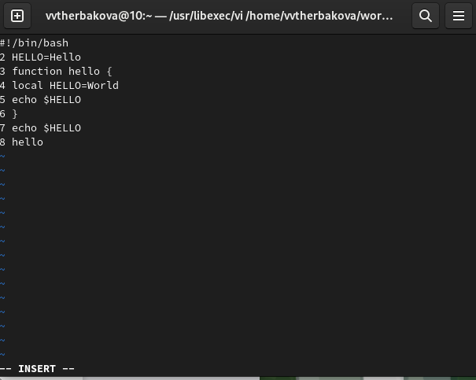
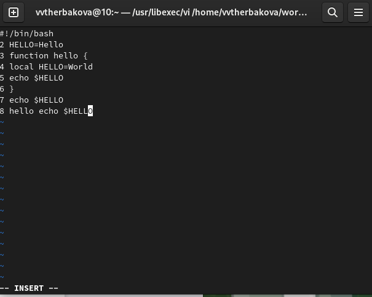
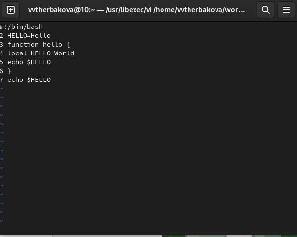
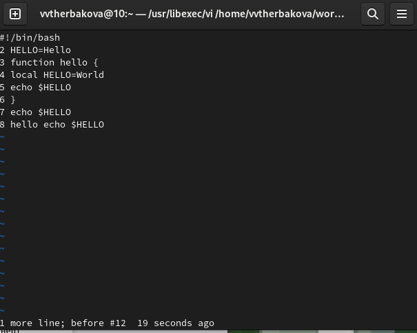

---
## Front matter
title: "Лабораторная работа №8"
subtitle: "Операционные системы"
author: "Щерабкова Вероника"

## Generic otions
lang: ru-RU
toc-title: "Отчет"

## Bibliography
bibliography: bib/cite.bib
csl: pandoc/csl/gost-r-7-0-5-2008-numeric.csl

## Pdf output format
toc: true # Table of contents
toc-depth: 2
lof: true # List of figures
lot: true # List of tables
fontsize: 12pt
linestretch: 1.5
papersize: a4
documentclass: scrreprt
## I18n polyglossia
polyglossia-lang:
  name: russian
  options:
	- spelling=modern
	- babelshorthands=true
polyglossia-otherlangs:
  name: english
## I18n babel
babel-lang: russian
babel-otherlangs: english
## Fonts
mainfont: PT Serif
romanfont: PT Serif
sansfont: PT Sans
monofont: PT Mono
mainfontoptions: Ligatures=TeX
romanfontoptions: Ligatures=TeX
sansfontoptions: Ligatures=TeX,Scale=MatchLowercase
monofontoptions: Scale=MatchLowercase,Scale=0.9
## Biblatex
biblatex: true
biblio-style: "gost-numeric"
biblatexoptions:
  - parentracker=true
  - backend=biber
  - hyperref=auto
  - language=auto
  - autolang=other*
  - citestyle=gost-numeric
## Pandoc-crossref LaTeX customization
figureTitle: "Рис."
tableTitle: "Таблица"
listingTitle: "Листинг"
lofTitle: "Список иллюстраций"
lotTitle: "Список таблиц"
lolTitle: "Листинги"
## Misc options
indent: true
header-includes:
  - \usepackage{indentfirst}
  - \usepackage{float} # keep figures where there are in the text
  - \floatplacement{figure}{H} # keep figures where there are in the text
---

# Цель работы
Познакомиться с операционной системой Linux. Получить практические навыки рабо-
ты с редактором vi, установленным по умолчанию практически во всех дистрибутивах.
# Задание

1. Ознакомиться с теоретическим материалом.
2. Ознакомиться с редактором vi.
3. Выполнить упражнения, используя команды vi

# Выполнение лабораторной работы
1. Создайте каталог с именем ~/work/os/lab06.Перейдите во вновь созданный каталог
{#fig:001 width=90%}

2. Вызовите vi и создайте файл hello.sh
{#fig:002 width=90%}

3. Нажмите клавишу i и вводите следующий текст
{#fig:003 width=90%}

4. Нажмите клавишу Esc для перехода в командный режим после завершения ввода
текста. Нажмите : для перехода в режим последней строки и внизу вашего экрана появится
приглашение в виде двоеточия.Нажмите w (записать) и q (выйти), а затем нажмите клавишу Enter для сохранения
вашего текста и завершения работы.
{#fig:004 width=90%}

5. Сделайте файл исполняемым
{#fig:005 width=90%}

6. Вызовите vi на редактирование файла
{#fig:006 width=90%}

7. Установите курсор в конец слова HELL второй строки.
{#fig:007 width=90%}

8. Перейдите в режим вставки и замените на HELLO. Нажмите Esc для возврата в команд-
ный режим
{#fig:008 width=90%}

9. Установите курсор на четвертую строку и сотрите слово LOCAL
{#fig:009 width=90%}

10. Перейдите в режим вставки и наберите следующий текст: local, нажмите Esc для
возврата в командный режим.
{#fig:010 width=90%}

11. Установите курсор на последней строке файла. Вставьте после неё строку, содержащую
следующий текст: echo $HELLO.
{#fig:011 width=90%}

12. Удалите последнюю строку.
{#fig:012 width=90%}

13. Введите команду отмены изменений u для отмены последней кома
{#fig:013 width=90%}

# Выводы
Познакомились с операционной системой Linux. Получили практические навыки рабо-
ты с редактором vi, установленным по умолчанию практически во всех дистрибутивах.
# Список литературы{.unnumbered}

::: {#refs}
:::
