---
## Front matter
lang: ru-RU
title: презентация по лабораторной №9
subtitle: Операционные системы
author:
  - Щербакова В.В
institute:
  - Российский университет дружбы народов, Москва, Россия
date: 08 апреля 2023

## i18n babel
babel-lang: russian
babel-otherlangs: english

## Formatting pdf
toc: false
toc-title: Содержание
slide_level: 2
aspectratio: 169
section-titles: true
theme: metropolis
header-includes:
 - \metroset{progressbar=frametitle,sectionpage=progressbar,numbering=fraction}
 - '\makeatletter'
 - '\beamer@ignorenonframefalse'
 - '\makeatother'
---

# Информация

## Докладчик

:::::::::::::: {.columns align=center}
::: {.column width="70%"}

  * Щербакова Вероника Владимировна
  * ученица 1-го курса
  * НБИбд-03-22
  * Российский университет дружбы народов
 
:::
::: {.column width="30%"}


:::
::::::::::::::

# Вводная часть

## Актуальность

- для тез кто не умеет пользоваться редактором emacs

## Цели и задачи

- Познакомиться с операционной системой Linux. Получить практические навыки рабо-
ты с редактором Emacs.
## Материалы и методы

- Процессор `pandoc` для входного формата Markdown
- Результирующие форматы
	- `pdf`
	- `html`
- Автоматизация процесса создания: `Makefile`

# Создание презентации

## Процессор `pandoc`

- Pandoc: преобразователь текстовых файлов
- Сайт: <https://pandoc.org/>
- Репозиторий: <https://github.com/jgm/pandoc>

## Формат `pdf`

- Использование LaTeX
- Пакет для презентации: [beamer](https://ctan.org/pkg/beamer)
- Тема оформления: `metropolis`

## Код для формата `pdf`

```yaml
slide_level: 2
aspectratio: 169
section-titles: true
theme: metropolis
```

## Формат `html`

- Используется фреймворк [reveal.js](https://revealjs.com/)
- Используется [тема](https://revealjs.com/themes/) `beige`

## Код для формата `html`

- Тема задаётся в файле `Makefile`

```make
REVEALJS_THEME = beige 
```
# Результаты

## Получающиеся форматы

- Полученный `pdf`-файл можно демонстрировать в любой программе просмотра `pdf`
- Полученный `html`-файл содержит в себе все ресурсы: изображения, css, скрипты

## Цели и задачи

- 1. Ознакомиться с теоретическим материалом.
2. Ознакомиться с редактором emacs.
3. Выполнить упражнения.


## Содержание исследования
1. Открыть emacs.
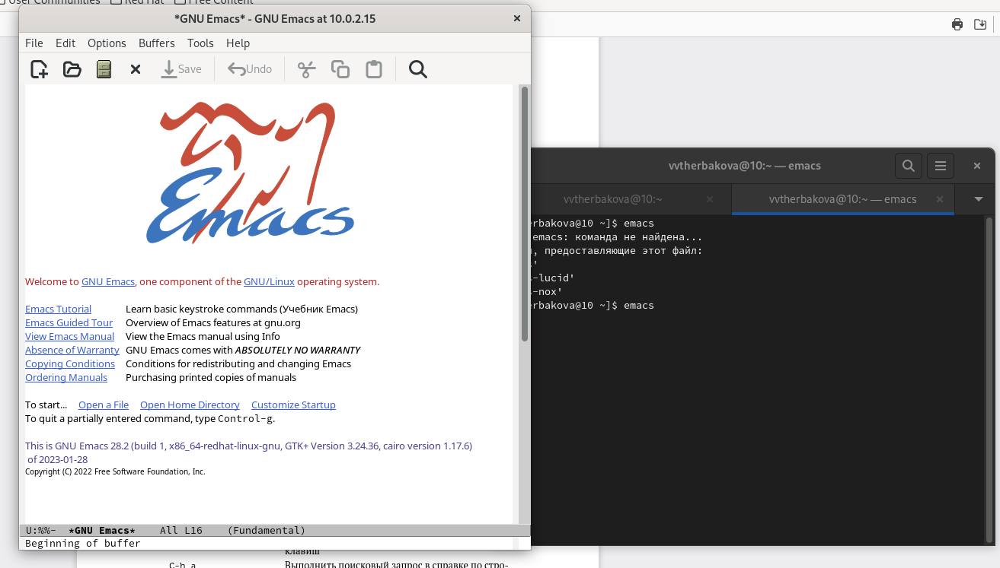{#fig:001 width=90%}

2. Создать файл lab07.sh с помощью комбинации Ctrl-x Ctrl-f (C-x C-f).
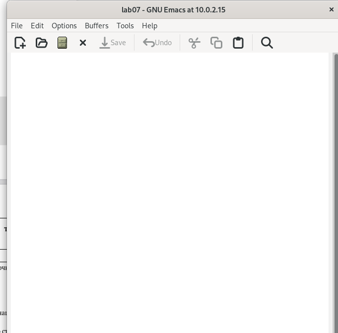{#fig:002 width=90%}

3. Наберите текст
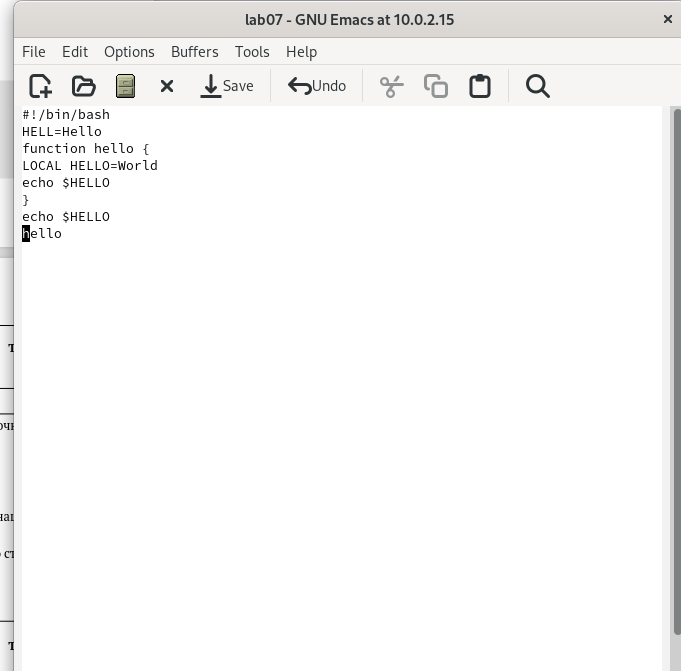{#fig:003 width=90%}

4.  1. Вырезать одной командой целую строку (С-k)
{#fig:004 width=90%}

4.  2. Вставить эту строку в конец файла (C-y).
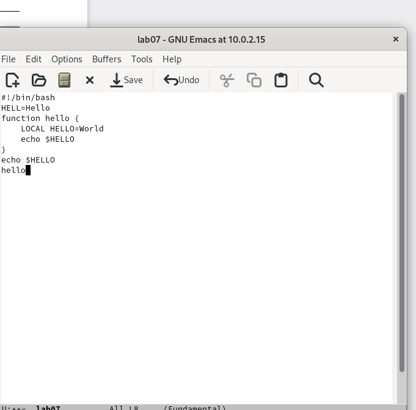{#fig:005 width=90%}

4.  3. Выделить область текста (C-space).
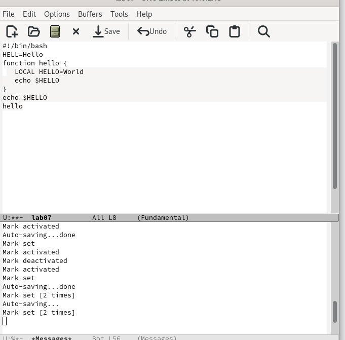{#fig:006 width=90%}

4.  4. Вставить область в конец файла
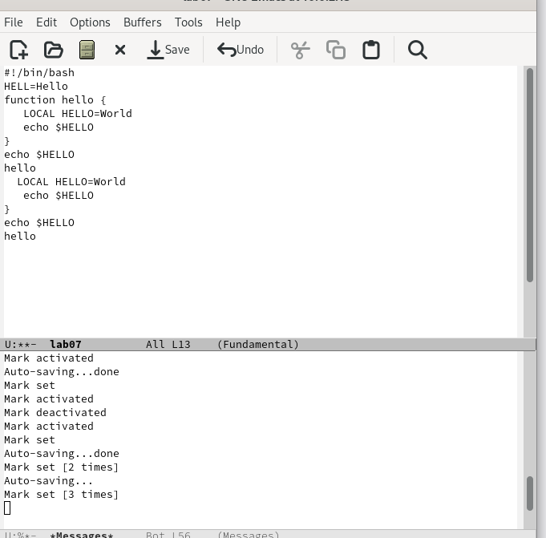{#fig:007 width=90%}

4.  5. Вновь выделить эту область и на этот раз вырезать её (C-w).
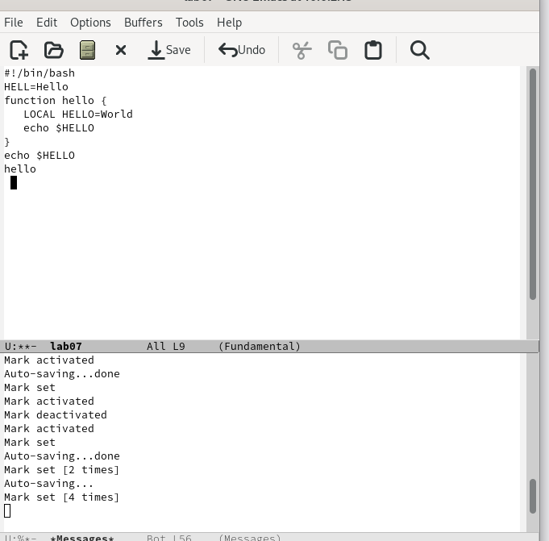{#fig:008 width=90%}

4.  6. Отмените последнее действие (C-/)
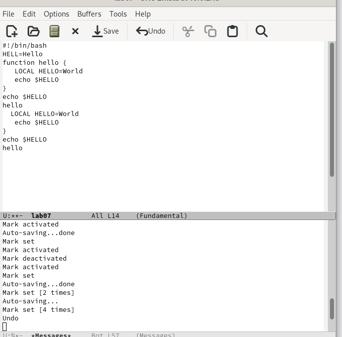{#fig:009 width=90%}

5.  1. Переместите курсор в начало буфера (M-<)
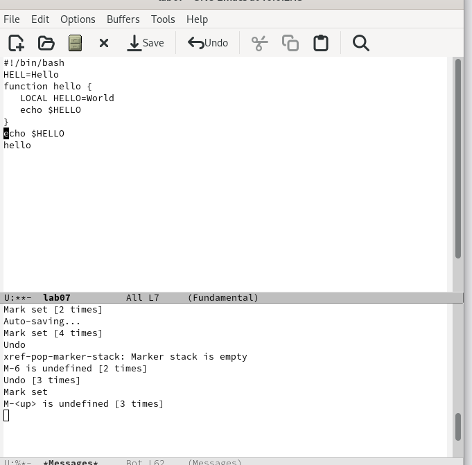{#fig:010 width=90%}

5.  2. Переместите курсор в конец буфера (M->).
{#fig:011 width=90%}

6. Вывести список активных буферов на экран (C-x C-b).
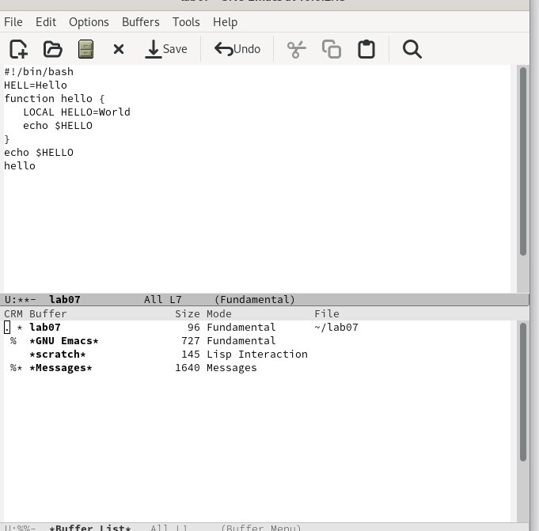{#fig:012 width=90%}

7.  1. Поделите фрейм на 4 части: разделите фрейм на два окна по вертикали (C-x 3)
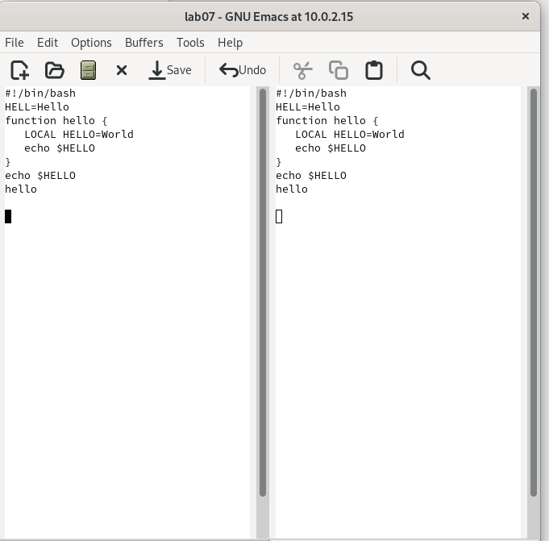{#fig:013 width=90%}

7.  2. а затем каждое из этих окон на две части по горизонтали (C-x 2) 
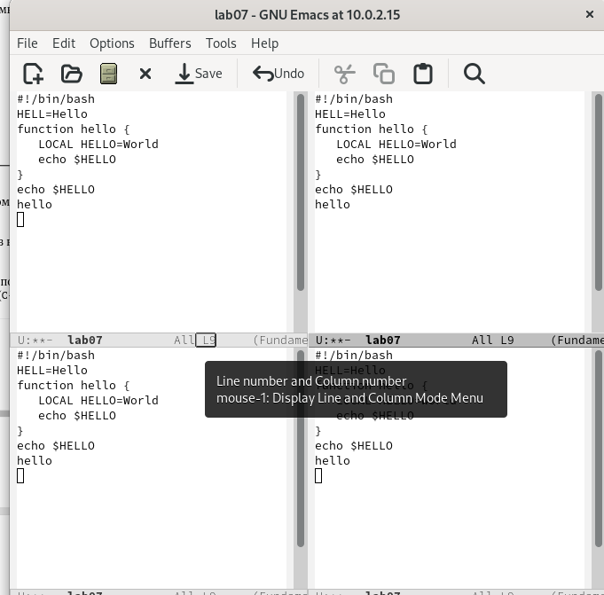{#fig:014 width=90%}

8.  1. Переключитесь в режим поиска (C-s) и найдите несколько слов, присутствующих
в тексте
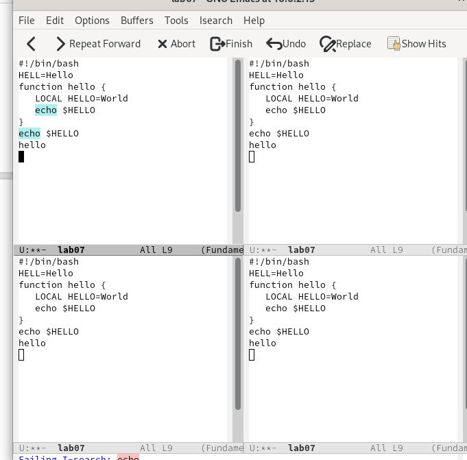{#fig:015 width=90%}

8.  2. Испробуйте другой режим поиска, нажав M-s o. Объясните, чем он отличается от
обычного режима?
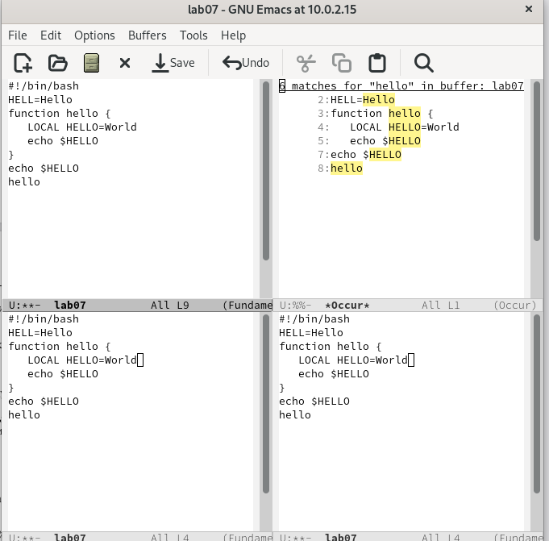{#fig:016 width=90%}

## Результаты

- Познакомились с операционной системой Linux. Получили практические навыки рабо-
ты с редактором Emacs.


::: {#refs}
:::
