---
## Front matter
title: "Лабораторная работа №9"
subtitle: "Операционные системы"
author: "Щербакова Вероника Владимировна НБИбд-03-22"

## Generic otions
lang: ru-RU
toc-title: "отчет"

## Bibliography
bibliography: bib/cite.bib
csl: pandoc/csl/gost-r-7-0-5-2008-numeric.csl

## Pdf output format
toc: true # Table of contents
toc-depth: 2
lof: true # List of figures
lot: true # List of tables
fontsize: 12pt
linestretch: 1.5
papersize: a4
documentclass: scrreprt
## I18n polyglossia
polyglossia-lang:
  name: russian
  options:
	- spelling=modern
	- babelshorthands=true
polyglossia-otherlangs:
  name: english
## I18n babel
babel-lang: russian
babel-otherlangs: english
## Fonts
mainfont: PT Serif
romanfont: PT Serif
sansfont: PT Sans
monofont: PT Mono
mainfontoptions: Ligatures=TeX
romanfontoptions: Ligatures=TeX
sansfontoptions: Ligatures=TeX,Scale=MatchLowercase
monofontoptions: Scale=MatchLowercase,Scale=0.9
## Biblatex
biblatex: true
biblio-style: "gost-numeric"
biblatexoptions:
  - parentracker=true
  - backend=biber
  - hyperref=auto
  - language=auto
  - autolang=other*
  - citestyle=gost-numeric
## Pandoc-crossref LaTeX customization
figureTitle: "Рис."
tableTitle: "Таблица"
listingTitle: "Листинг"
lofTitle: "Список иллюстраций"
lotTitle: "Список таблиц"
lolTitle: "Листинги"
## Misc options
indent: true
header-includes:
  - \usepackage{indentfirst}
  - \usepackage{float} # keep figures where there are in the text
  - \floatplacement{figure}{H} # keep figures where there are in the text
---

# Цель работы
Познакомиться с операционной системой Linux. Получить практические навыки рабо-
ты с редактором Emacs.

# Задание

1. Ознакомиться с теоретическим материалом.
2. Ознакомиться с редактором emacs.
3. Выполнить упражнения.

# Выполнение лабораторной работы
1. Открыть emacs.
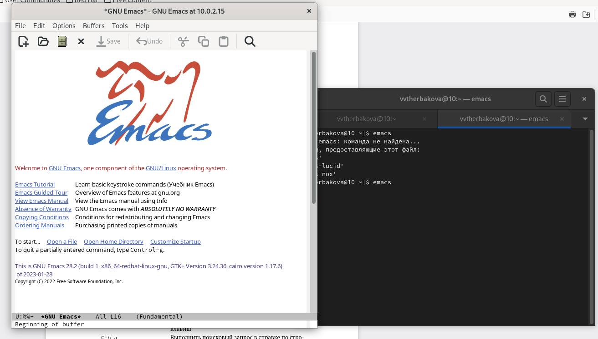{#fig:001 width=90%}

2. Создать файл lab07.sh с помощью комбинации Ctrl-x Ctrl-f (C-x C-f).
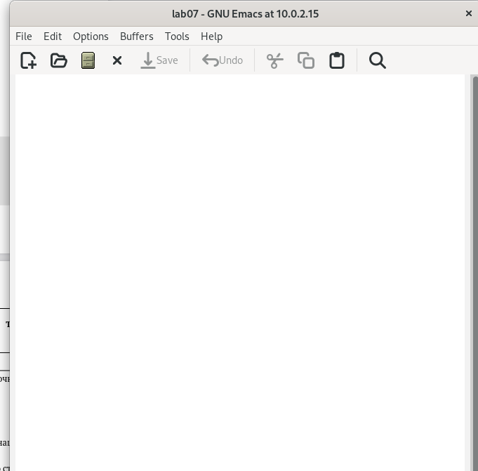{#fig:002 width=90%}

3. Наберите текст
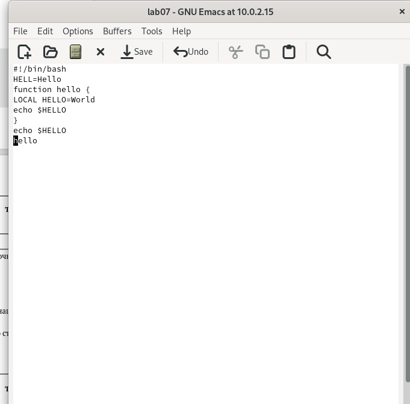{#fig:003 width=90%}

4.  1. Вырезать одной командой целую строку (С-k)
{#fig:004 width=90%}

4.  2. Вставить эту строку в конец файла (C-y).
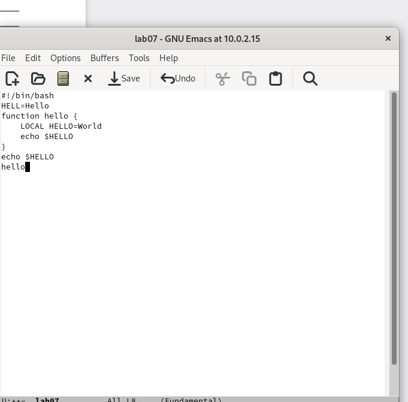{#fig:005 width=90%}

4.  3. Выделить область текста (C-space).
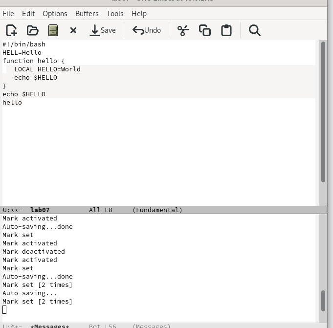{#fig:006 width=90%}

4.  4. Вставить область в конец файла
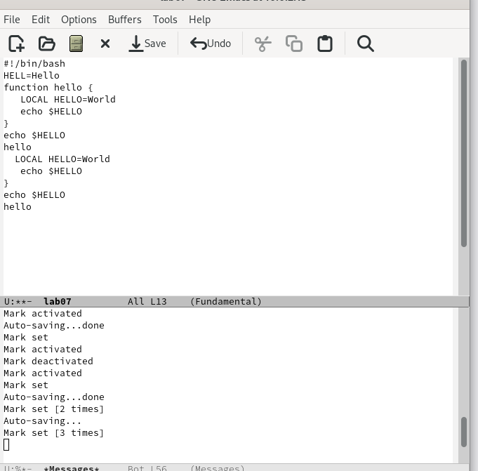{#fig:007 width=90%}

4.  5. Вновь выделить эту область и на этот раз вырезать её (C-w).
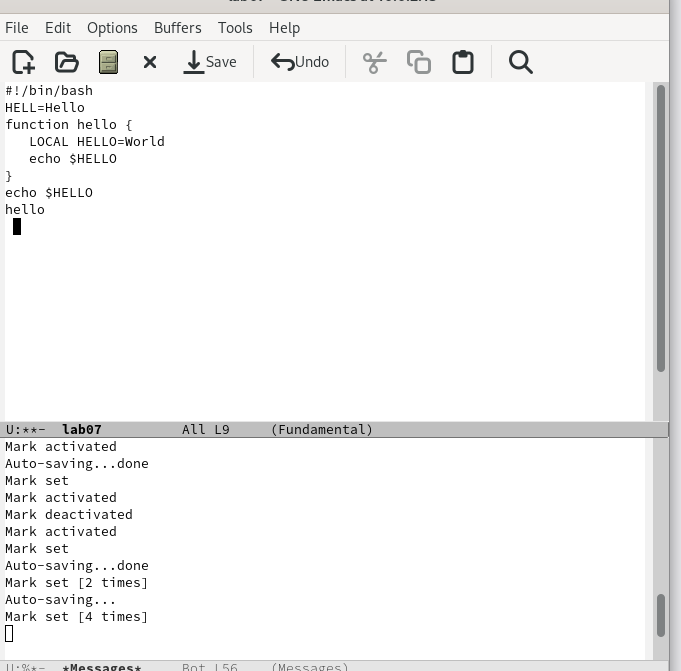{#fig:008 width=90%}

4.  6. Отмените последнее действие (C-/)
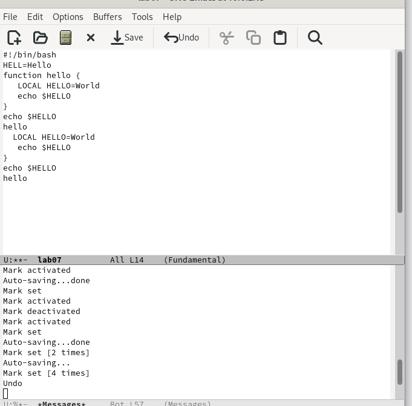{#fig:009 width=90%}

5.  1. Переместите курсор в начало буфера (M-<)
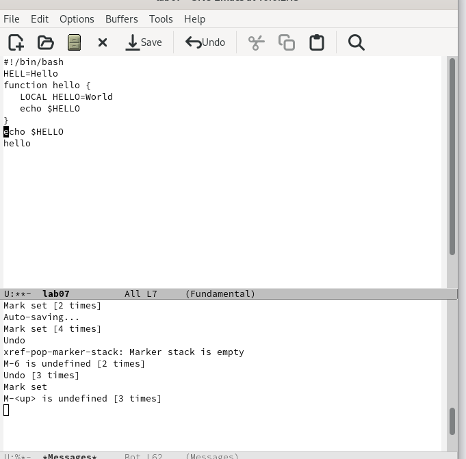{#fig:010 width=90%}

5.  2. Переместите курсор в конец буфера (M->).
{#fig:011 width=90%}

6. Вывести список активных буферов на экран (C-x C-b).
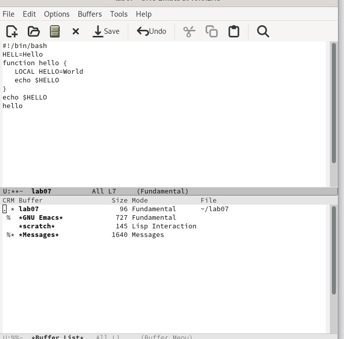{#fig:012 width=90%}

7.  1. Поделите фрейм на 4 части: разделите фрейм на два окна по вертикали (C-x 3)
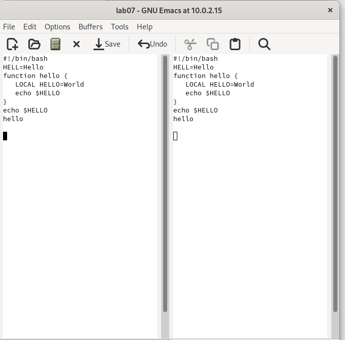{#fig:013 width=90%}

7.  2. а затем каждое из этих окон на две части по горизонтали (C-x 2) 
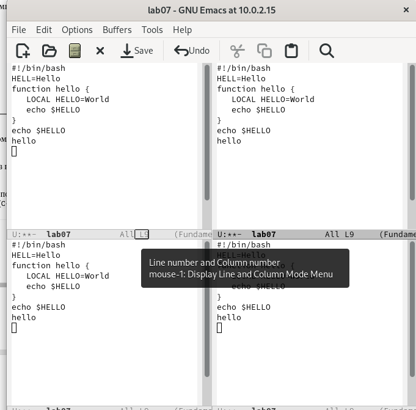{#fig:014 width=90%}

8.  1. Переключитесь в режим поиска (C-s) и найдите несколько слов, присутствующих
в тексте
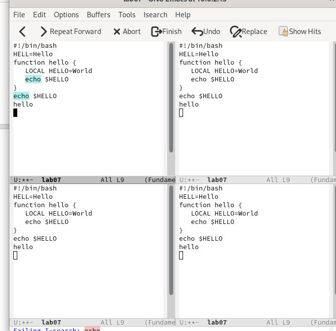{#fig:015 width=90%}

8.  2. Испробуйте другой режим поиска, нажав M-s o. Объясните, чем он отличается от
обычного режима?
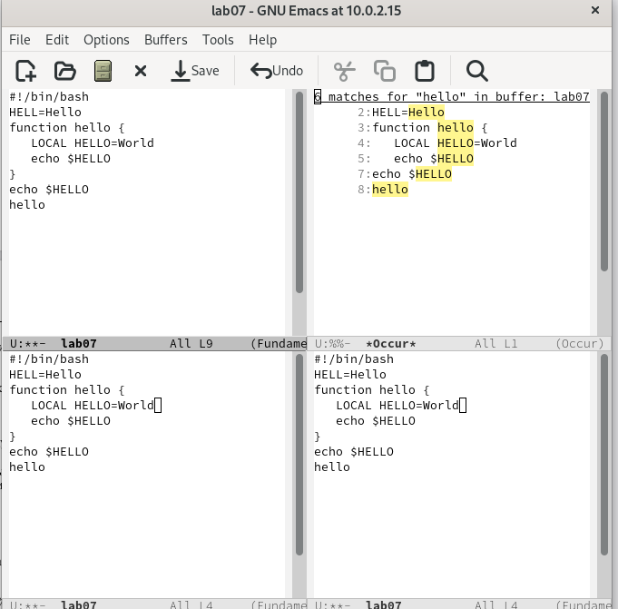{#fig:016 width=90%}

# Выводы
Познакомились с операционной системой Linux. Получили практические навыки рабо-
ты с редактором Emacs.

::: {#refs}
:::
