---
## Front matter
lang: ru-RU
title: Презентация по лабораторной работе №10
subtitle: Операционные истемы
author:
  - Щербакова В.В.
institute:
  - Российский университет дружбы народов, Москва, Россия
date: 14 апреля 2023

## i18n babel
babel-lang: russian
babel-otherlangs: english

## Formatting pdf
toc: false
toc-title: Презентация
slide_level: 2
aspectratio: 169
section-titles: true
theme: metropolis
header-includes:
 - \metroset{progressbar=frametitle,sectionpage=progressbar,numbering=fraction}
 - '\makeatletter'
 - '\beamer@ignorenonframefalse'
 - '\makeatother'
---

# Информация

## Докладчик

:::::::::::::: {.columns align=center}
::: {.column width="70%"}

  * Щербакова Вероника Владимировна
  * Студентка 1-го курса НБИбд-03-22
  * Российский университет дружбы народов
 
:::
::: {.column width="30%"}


:::
::::::::::::::

# Вводная часть

## Актуальность

- Для ребят кто хочет нааааучиться основам программирования в оболочке ОС UNIX/Linux. Написание небольших команднх файлов

## Цели и задачи

- Изучить основы программирования в оболочке ОС UNIX/Linux. Научиться писать
небольшие командные файлы

## Материалы и методы

- Процессор `pandoc` для входного формата Markdown
- Результирующие форматы
	- `pdf`
	- `html`
- Автоматизация процесса создания: `Makefile`

# Создание презентации

## Процессор `pandoc`

- Pandoc: преобразователь текстовых файлов
- Сайт: <https://pandoc.org/>
- Репозиторий: <https://github.com/jgm/pandoc>

## Формат `pdf`

- Использование LaTeX
- Пакет для презентации: [beamer](https://ctan.org/pkg/beamer)
- Тема оформления: `metropolis`

## Код для формата `pdf`

```yaml
slide_level: 2
aspectratio: 169
section-titles: true
theme: metropolis
```

## Формат `html`

- Используется фреймворк [reveal.js](https://revealjs.com/)
- Используется [тема](https://revealjs.com/themes/) `beige`

## Код для формата `html`

- Тема задаётся в файле `Makefile`

```make
REVEALJS_THEME = beige 
```
# Результаты

## Получающиеся форматы

- Полученный `pdf`-файл можно демонстрировать в любой программе просмотра `pdf`
- Полученный `html`-файл содержит в себе все ресурсы: изображения, css, скрипты


## Материалы и методы

- Представляйте данные качественно
- Количественно, только если крайне необходимо
- Излишние детали не нужны

## Содержание исследования
1. создали файл с названием script.sh; изменили код защиты этого командного файла, обеспечив доступ к этому файлу по
выполнению chmod +x имя_файла.
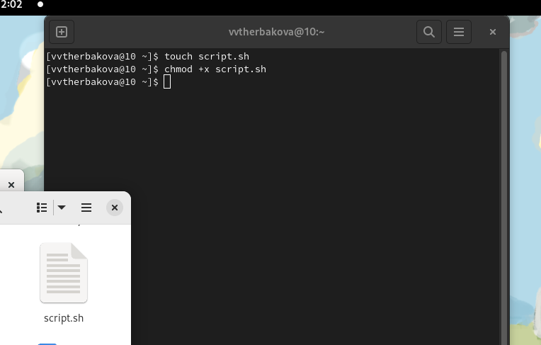{#fig:001 width=90%}

2. Написать скрипт, который при запуске будет делать резервную копию самого себя (то
есть файла, в котором содержится его исходный код) в другую директорию backup
в вашем домашнем каталоге. 
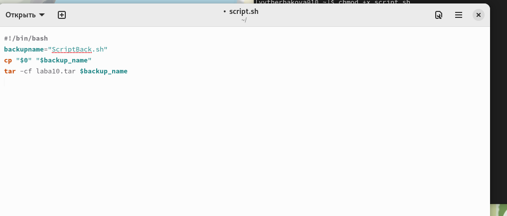{#fig:002 width=90%}

3. создали файл с названием script2.sh; изменили код защиты этого командного файла, обеспечив доступ к этому файлу по
выполнению chmod +x имя_файла.
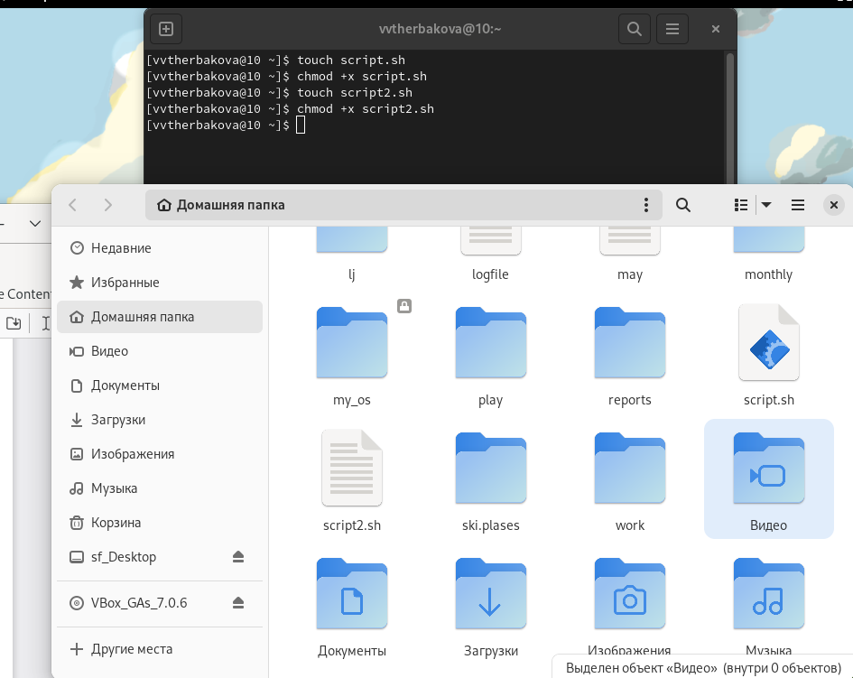{#fig:003 width=90%}

4. Написать пример командного файла, обрабатывающего любое произвольное число
аргументов командной строки, в том числе превышающее десять. 
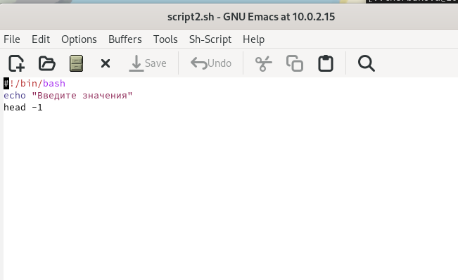{#fig:005 width=90%}

5. Например, скрипт может последовательно распечатывать значения всех переданных аргументов.
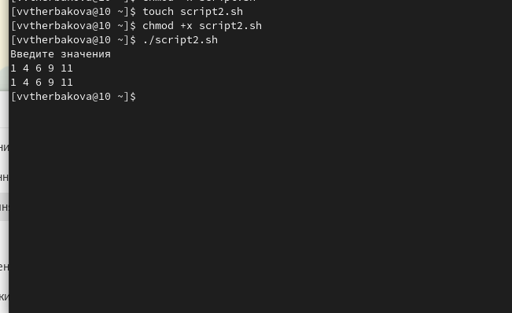{#fig:004 width=90%}

6. создали файл с названием filevr.sh; изменили код защиты этого командного файла, обеспечив доступ к этому файлу по
выполнению chmod +x имя_файла.
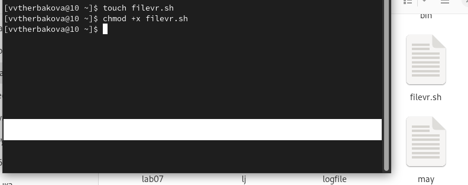{#fig:006 width=90%}

7. Написать командный файл — аналог команды ls (без использования самой этой ко-
манды и команды dir). 
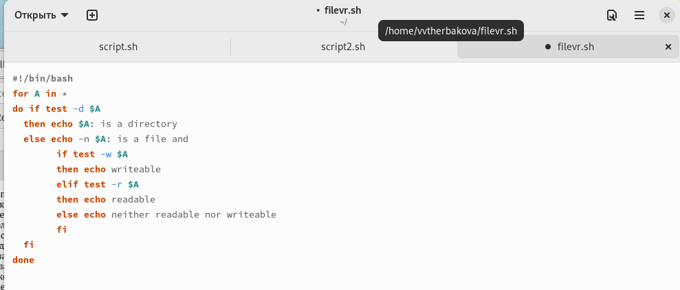{#fig:007 width=90%}

8. Требуется, чтобы он выдавал информацию о нужном каталоге
и выводил информацию о возможностях доступа к файлам этого каталога
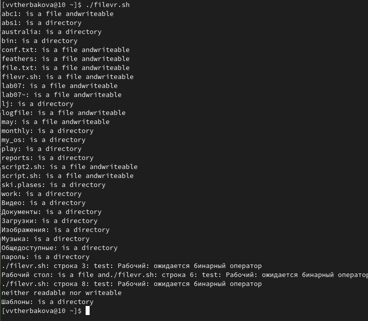{#fig:008 width=90%}

9. создали файл с названием filevr2.sh; изменили код защиты этого командного файла, обеспечив доступ к этому файлу по
выполнению chmod +x имя_файла
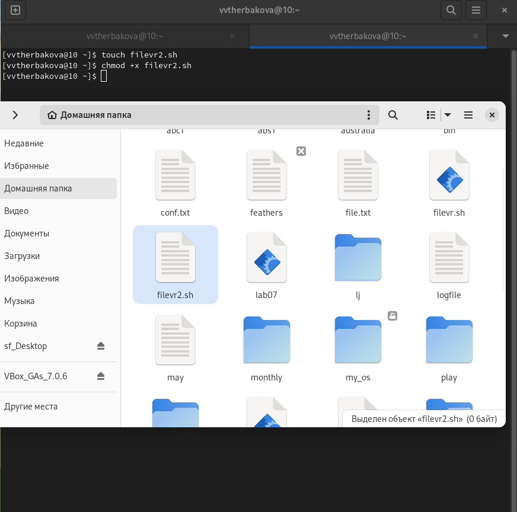{#fig:009 width=90%}

10. Написать командный файл, который получает в качестве аргумента командной строки
формат файла (.txt, .doc, .jpg, .pdf и т.д.) 
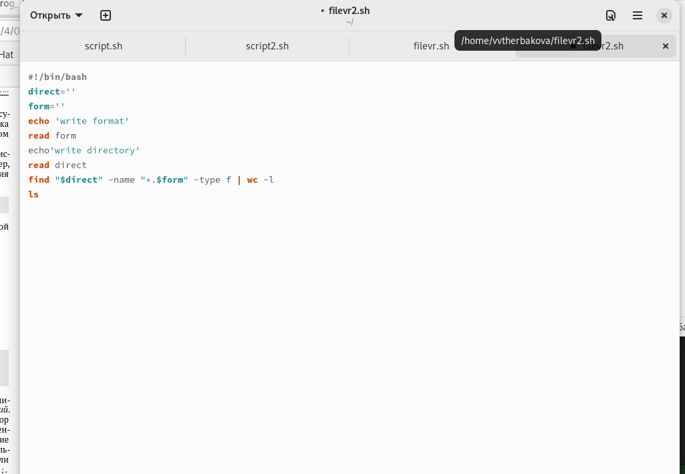{#fig:010 width=90%}

11. Вычислить количество таких файлов
в указанной директории. Путь к директории также передаётся в виде аргумента ко-
мандной строки.
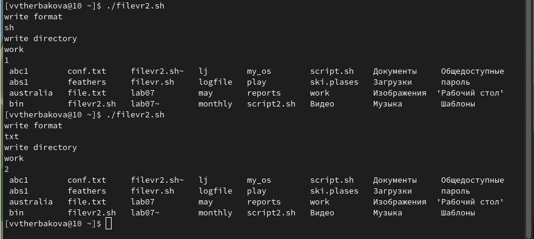{#fig:011 width=90%}


## Итоговый слайд

- Изучили основы программирования в оболочке ОС UNIX/Linux. Научились писать
небольшие командные файлы.
:::

