---
## Front matter
title: "Лабораторная рабта №10"
subtitle: "Операциоые системы"
author: "Щербакова Вероника Владимировна,НБИбд-03-22"

## Generic otions
lang: ru-RU
toc-title: "Отчет"

## Bibliography
bibliography: bib/cite.bib
csl: pandoc/csl/gost-r-7-0-5-2008-numeric.csl

## Pdf output format
toc: true # Table of contents
toc-depth: 2
lof: true # List of figures
lot: true # List of tables
fontsize: 12pt
linestretch: 1.5
papersize: a4
documentclass: scrreprt
## I18n polyglossia
polyglossia-lang:
  name: russian
  options:
	- spelling=modern
	- babelshorthands=true
polyglossia-otherlangs:
  name: english
## I18n babel
babel-lang: russian
babel-otherlangs: english
## Fonts
mainfont: PT Serif
romanfont: PT Serif
sansfont: PT Sans
monofont: PT Mono
mainfontoptions: Ligatures=TeX
romanfontoptions: Ligatures=TeX
sansfontoptions: Ligatures=TeX,Scale=MatchLowercase
monofontoptions: Scale=MatchLowercase,Scale=0.9
## Biblatex
biblatex: true
biblio-style: "gost-numeric"
biblatexoptions:
  - parentracker=true
  - backend=biber
  - hyperref=auto
  - language=auto
  - autolang=other*
  - citestyle=gost-numeric
## Pandoc-crossref LaTeX customization
figureTitle: "Рис."
tableTitle: "Таблица"
listingTitle: "Листинг"
lofTitle: "Список иллюстраций"
lotTitle: "Список таблиц"
lolTitle: "Листинги"
## Misc options
indent: true
header-includes:
  - \usepackage{indentfirst}
  - \usepackage{float} # keep figures where there are in the text
  - \floatplacement{figure}{H} # keep figures where there are in the text
---

# Цель работы
Изучить основы программирования в оболочке ОС UNIX/Linux. Научиться писать
небольшие командные файлы.

# Выполнение лабораторной работы

1. создали файл с названием script.sh; изменили код защиты этого командного файла, обеспечив доступ к этому файлу по
выполнению chmod +x имя_файла.
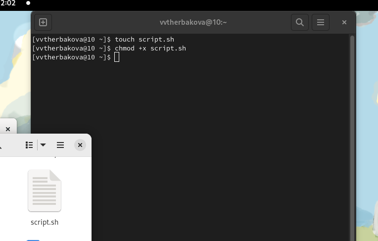{#fig:001 width=90%}

2. Написать скрипт, который при запуске будет делать резервную копию самого себя (то
есть файла, в котором содержится его исходный код) в другую директорию backup
в вашем домашнем каталоге. 
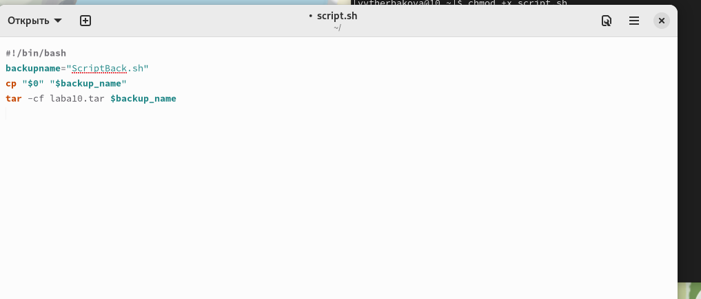{#fig:002 width=90%}

3. создали файл с названием script2.sh; изменили код защиты этого командного файла, обеспечив доступ к этому файлу по
выполнению chmod +x имя_файла.
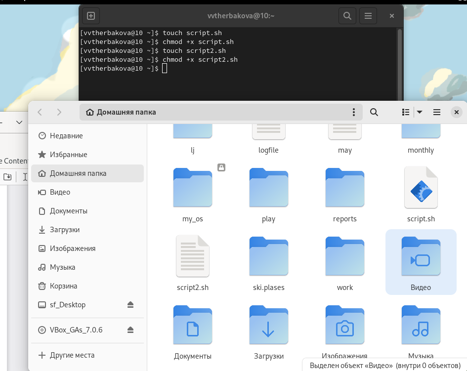{#fig:003 width=90%}

4. Написать пример командного файла, обрабатывающего любое произвольное число
аргументов командной строки, в том числе превышающее десять. 
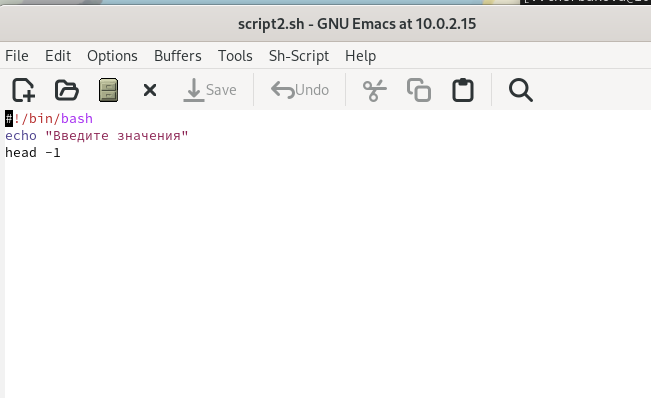{#fig:005 width=90%}

5. Например, скрипт может последовательно распечатывать значения всех переданных аргументов.
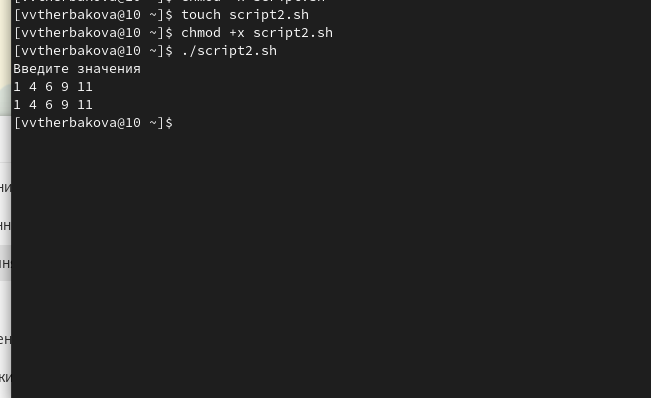{#fig:004 width=90%}

6. создали файл с названием filevr.sh; изменили код защиты этого командного файла, обеспечив доступ к этому файлу по
выполнению chmod +x имя_файла.
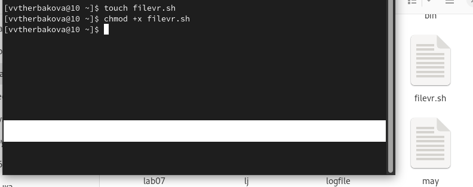{#fig:006 width=90%}

7. Написать командный файл — аналог команды ls (без использования самой этой ко-
манды и команды dir). 
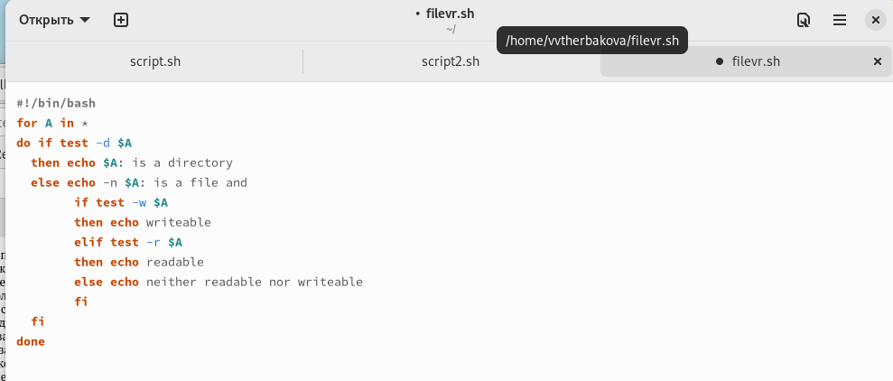{#fig:007 width=90%}

8. Требуется, чтобы он выдавал информацию о нужном каталоге
и выводил информацию о возможностях доступа к файлам этого каталога
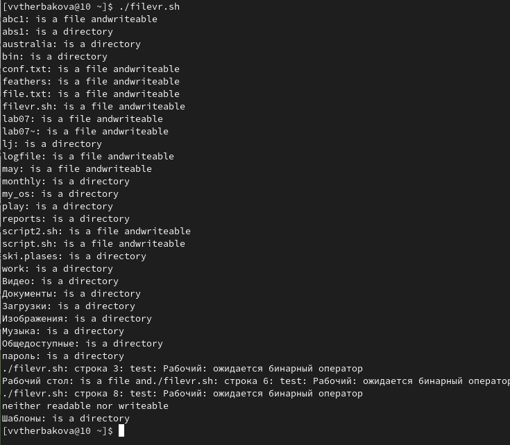{#fig:008 width=90%}

9. создали файл с названием filevr2.sh; изменили код защиты этого командного файла, обеспечив доступ к этому файлу по
выполнению chmod +x имя_файла
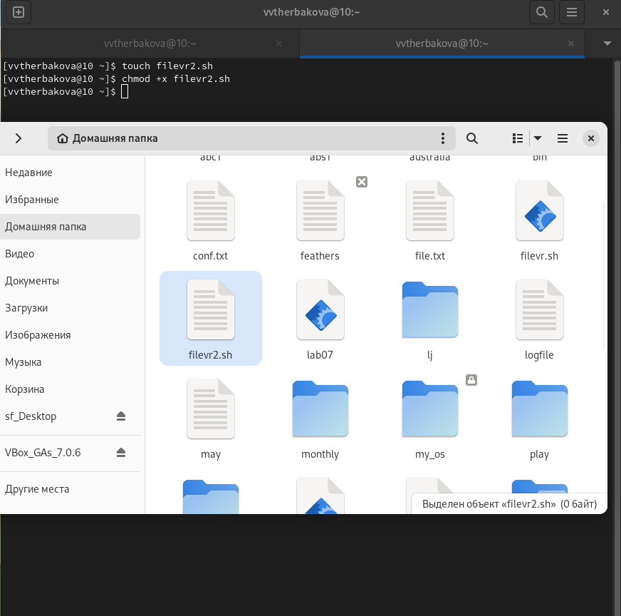{#fig:009 width=90%}

10. Написать командный файл, который получает в качестве аргумента командной строки
формат файла (.txt, .doc, .jpg, .pdf и т.д.) 
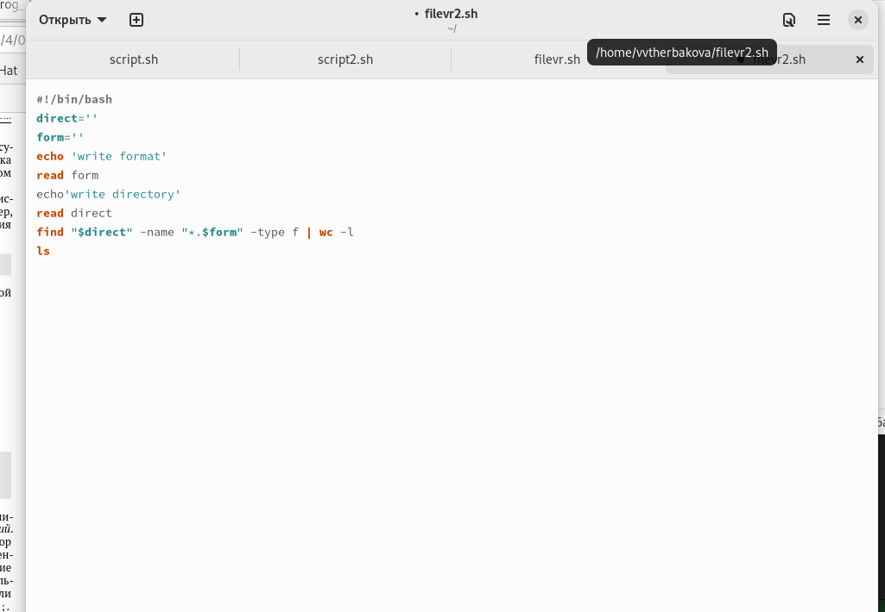{#fig:010 width=90%}

11. Вычислить количество таких файлов
в указанной директории. Путь к директории также передаётся в виде аргумента ко-
мандной строки.
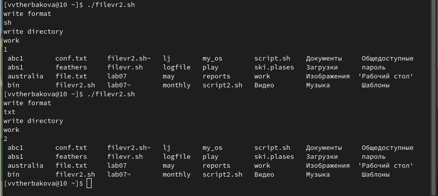{#fig:011 width=90%}

# Выводы
Изучили основы программирования в оболочке ОС UNIX/Linux. Научились писать
небольшие командные файлы.

::: {#refs}
:::
