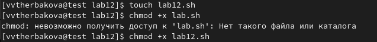
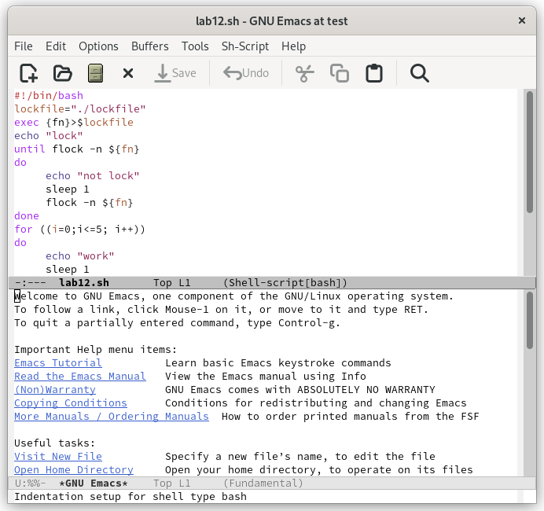
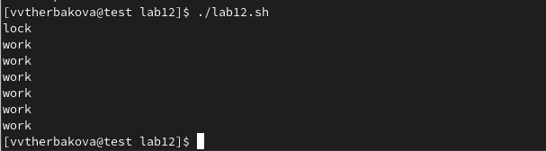
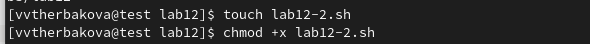
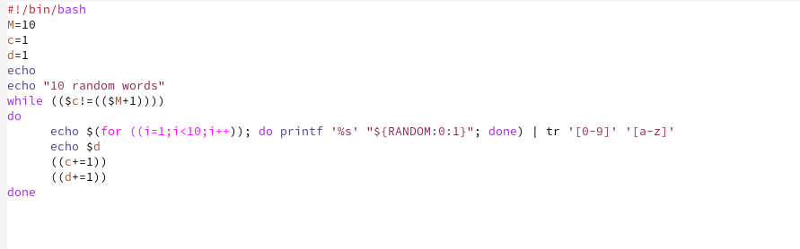
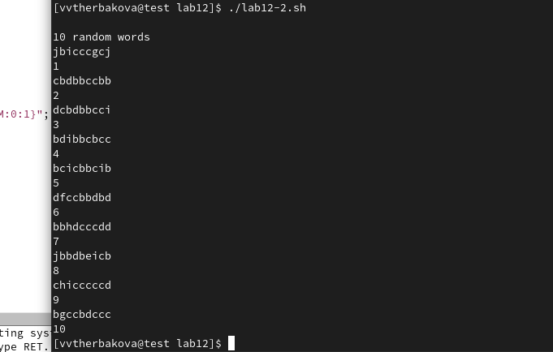

---
## Front matter
lang: ru-RU
title: Лабораторная работа №12
subtitle: Операционные системы
author:
  - Щербакова В.В.
institute:
  - Российский университет дружбы народов, Москва, Россия
  - Объединённый институт ядерных исследований, Дубна, Россия
date: 16 марта 2023

## i18n babel
babel-lang: russian
babel-otherlangs: english

## Formatting pdf
toc: false
toc-title: Содержание
slide_level: 2
aspectratio: 169
section-titles: true
theme: metropolis
header-includes:
 - \metroset{progressbar=frametitle,sectionpage=progressbar,numbering=fraction}
 - '\makeatletter'
 - '\beamer@ignorenonframefalse'
 - '\makeatother'
---

# Информация

## Докладчик

:::::::::::::: {.columns align=center}
::: {.column width="70%"}

  * Щербакова Вероника Владимировна
  * студентка 1-го курса
  * Бизнесс-Информатика
  * Российский университет дружбы народов
 

:::
::: {.column width="30%"}

:::
::::::::::::::

# Вводная часть

## Актуальность

- Для тех, кто хочет научиться управлять процессами (и заданиями), по
проверке использования диска и обслуживанию файловых систем


## Цели и задачи

Изучить основы программирования в оболочке ОС UNIX. Научиться писать более
сложные командные файлы с использованием логических управляющих конструкций
и циклов.

## Материалы и методы

- Процессор `pandoc` для входного формата Markdown
- Результирующие форматы
	- `pdf`
	- `html`
- Автоматизация процесса создания: `Makefile`

# Создание презентации

## Процессор `pandoc`

- Pandoc: преобразователь текстовых файлов
- Сайт: <https://pandoc.org/>
- Репозиторий: <https://github.com/jgm/pandoc>

## Формат `pdf`

- Использование LaTeX
- Пакет для презентации: [beamer](https://ctan.org/pkg/beamer)
- Тема оформления: `metropolis`

## Код для формата `pdf`

```yaml
slide_level: 2
aspectratio: 169
section-titles: true
theme: metropolis
```

## Формат `html`

- Используется фреймворк [reveal.js](https://revealjs.com/)
- Используется [тема](https://revealjs.com/themes/) `beige`

## Код для формата `html`

- Тема задаётся в файле `Makefile`

```make
REVEALJS_THEME = beige 
```
# Результаты

## Получающиеся форматы

- Полученный `pdf`-файл можно демонстрировать в любой программе просмотра `pdf`
- Полученный `html`-файл содержит в себе все ресурсы: изображения, css, скрипты


## Содержание исследования

1. Написать командный файл, реализующий упрощённый механизм семафоров. Ко-
мандный файл должен в течение некоторого времени t1 дожидаться освобождения
ресурса, выдавая об этом сообщение, а дождавшись его освобождения, использовать
его в течение некоторого времени t2<>t1, также выдавая информацию о том, что
ресурс используется соответствующим командным файлом (процессом). Запустить
командный файл в одном виртуальном терминале в фоновом режиме, перенаправив
его вывод в другой (> /dev/tty#, где # — номер терминала куда перенаправляется
вывод), в котором также запущен этот файл, но не фоновом, а в привилегированном
режиме. Доработать программу так, чтобы имелась возможность взаимодействия трёх
и более процессов.
{#fig:001 width=90%}
{#fig:002 width=90%}
{#fig:003 width=90%}

2. Реализовать команду man с помощью командного файла. Изучите содержимое ката-
лога /usr/share/man/man1. В нем находятся архивы текстовых файлов, содержащих
справку по большинству установленных в системе программ и команд. Каждый архив
можно открыть командой less сразу же просмотрев содержимое справки. Командный
файл должен получать в виде аргумента командной строки название команды и в виде
результата выдавать справку об этой команде или сообщение об отсутствии справки,
если соответствующего файла нет в каталоге man1.
{#fig:004 width=90%}
3. Используя встроенную переменную $RANDOM, напишите командный файл, генерирую-
щий случайную последовательность букв латинского алфавита. Учтите, что $RANDOM
выдаёт псевдослучайные числа в диапазоне от 0 до 32767.
{#fig:005 width=90%}
{#fig:006 width=90%}


## Результаты

- Изучили основы программирования в оболочке ОС UNIX. Научились писать более
сложные командные файлы с использованием логических управляющих конструкций
и циклов.

## Итоговый слайд

- Спасибо за внимание


:::

