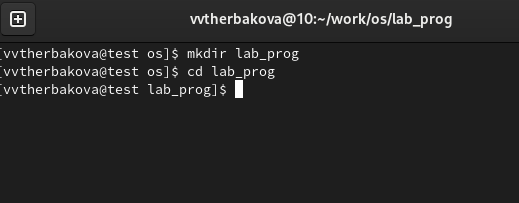
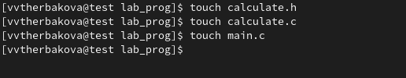
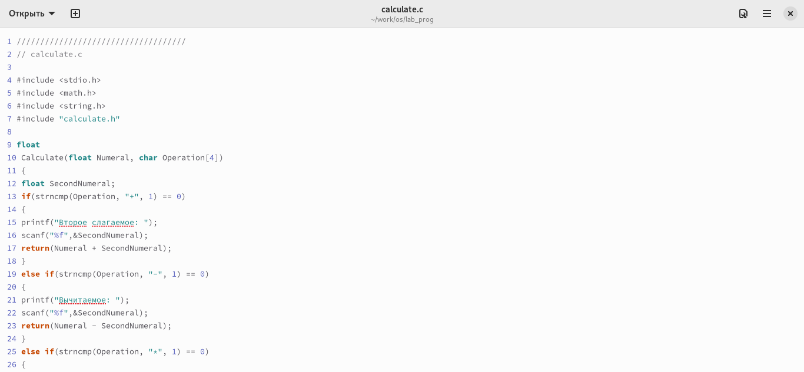
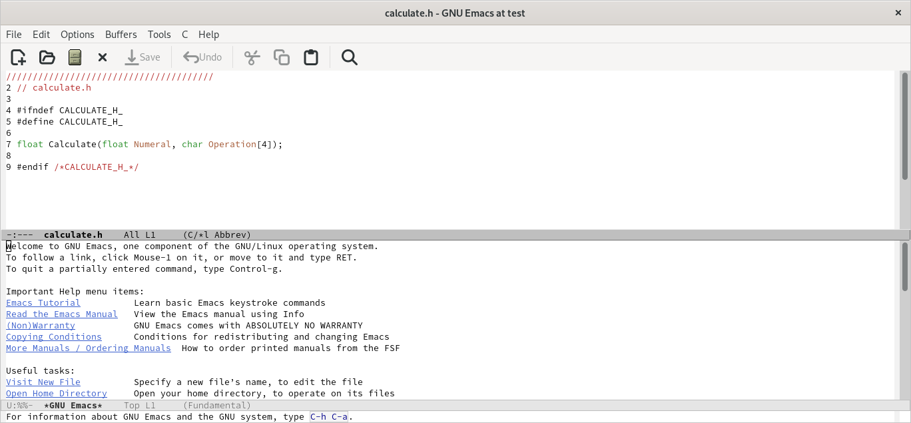
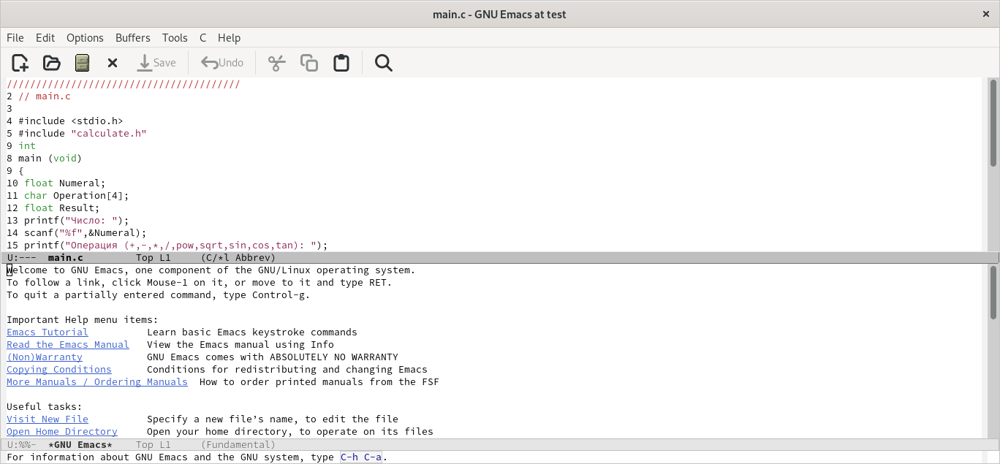
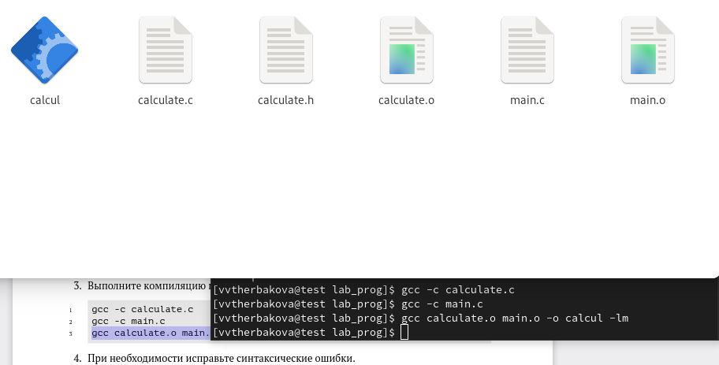
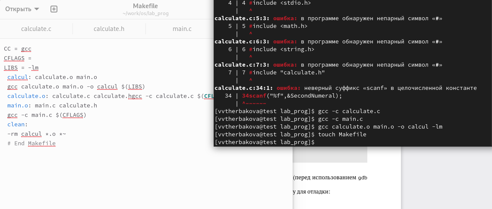
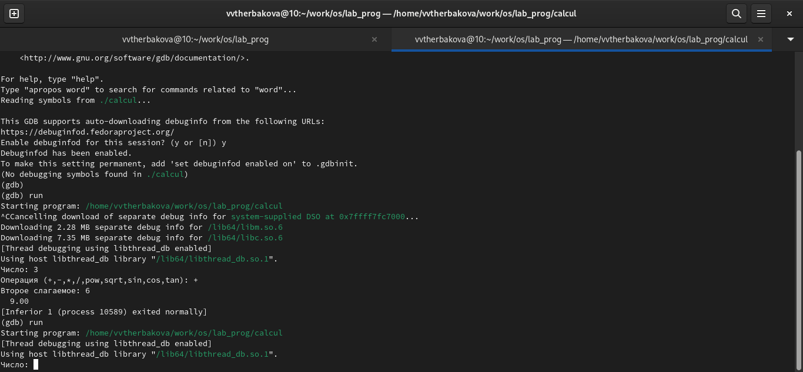
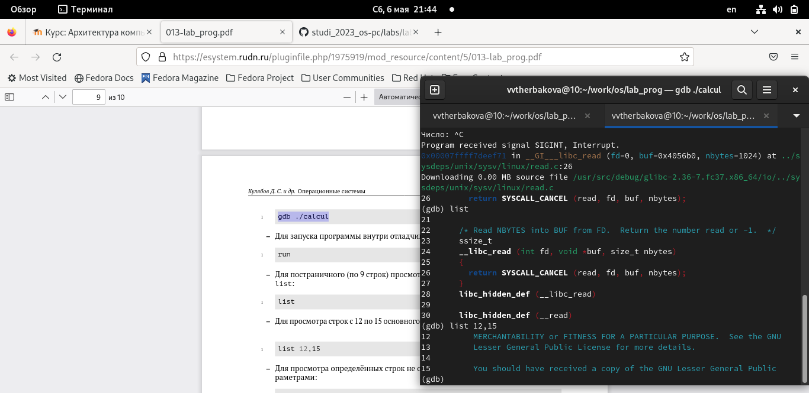
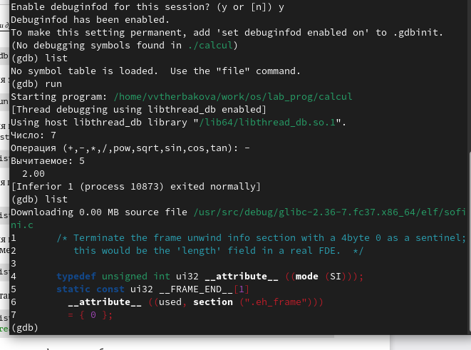

---
## Front matter
title: "Лабораторная работа №13"
subtitle: "Операционные системы"
author: "Щербакова Вероника Владимировна НБИбд-03-22"

## Generic otions
lang: ru-RU
toc-title: "Содержание"

## Bibliography
bibliography: bib/cite.bib
csl: pandoc/csl/gost-r-7-0-5-2008-numeric.csl

## Pdf output format
toc: true # Table of contents
toc-depth: 2
lof: true # List of figures
lot: true # List of tables
fontsize: 12pt
linestretch: 1.5
papersize: a4
documentclass: scrreprt
## I18n polyglossia
polyglossia-lang:
  name: russian
  options:
	- spelling=modern
	- babelshorthands=true
polyglossia-otherlangs:
  name: english
## I18n babel
babel-lang: russian
babel-otherlangs: english
## Fonts
mainfont: PT Serif
romanfont: PT Serif
sansfont: PT Sans
monofont: PT Mono
mainfontoptions: Ligatures=TeX
romanfontoptions: Ligatures=TeX
sansfontoptions: Ligatures=TeX,Scale=MatchLowercase
monofontoptions: Scale=MatchLowercase,Scale=0.9
## Biblatex
biblatex: true
biblio-style: "gost-numeric"
biblatexoptions:
  - parentracker=true
  - backend=biber
  - hyperref=auto
  - language=auto
  - autolang=other*
  - citestyle=gost-numeric
## Pandoc-crossref LaTeX customization
figureTitle: "Рис."
tableTitle: "Таблица"
listingTitle: "Листинг"
lofTitle: "Список иллюстраций"
lotTitle: "Список таблиц"
lolTitle: "Листинги"
## Misc options
indent: true
header-includes:
  - \usepackage{indentfirst}
  - \usepackage{float} # keep figures where there are in the text
  - \floatplacement{figure}{H} # keep figures where there are in the text
---

# Цель работы
Приобрести простейшие навыки разработки, анализа, тестирования и отладки при-
ложений в ОС типа UNIX/Linux на примере создания на языке программирования
С калькулятора с простейшими функциями.
# Выполнение лабораторной работы
1.  домашнем каталоге создайте подкаталог ~/work/os/lab_prog
{#fig:001 width=90%}
2. Создайте в нём файлы: calculate.h, calculate.c, main.c.
{#fig:002 width=90%}
3.   1.Реализация функций калькулятора в файле calculate.h:
{#fig:003 width=90%}
     2. Интерфейсный файл calculate.h
{#fig:004 width=90%}    
     3. Основной файл main.c,
{#fig:005 width=90%}
4. Выполните компиляцию программы посредством gcc:
{#fig:006 width=90%}
5. Создайте Makefile со следующим содержанием
{#fig:007 width=90%}
6. С помощью gdb выполните отладку программы calcul (перед использованием gdb
исправьте Makefile):.
{#fig:008 width=90%}
{#fig:009 width=90%}
{#fig:010 width=90%}

# Выводы
Приобрели простейшие навыки разработки, анализа, тестирования и отладки при-
ложений в ОС типа UNIX/Linux на примере создания на языке программирования
С калькулятора с простейшими функциями.

::: {#refs}
:::
