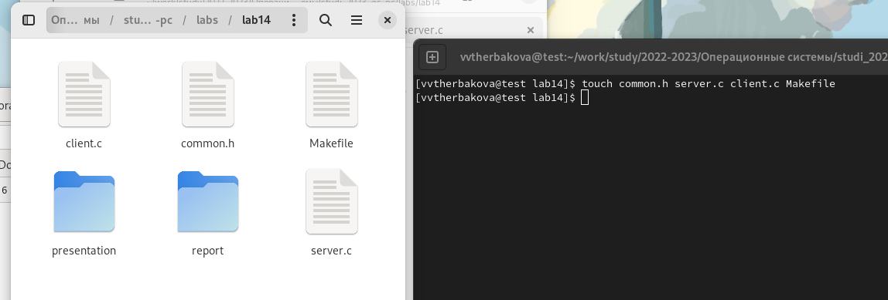
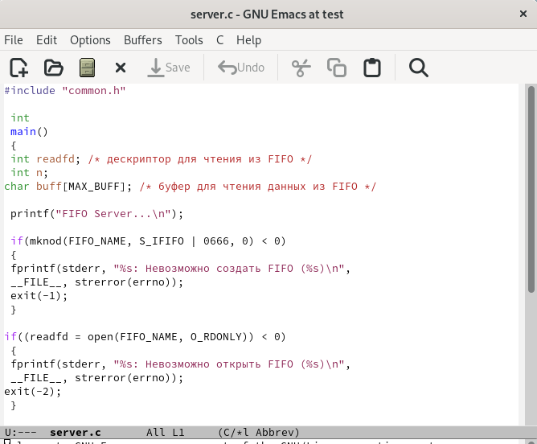
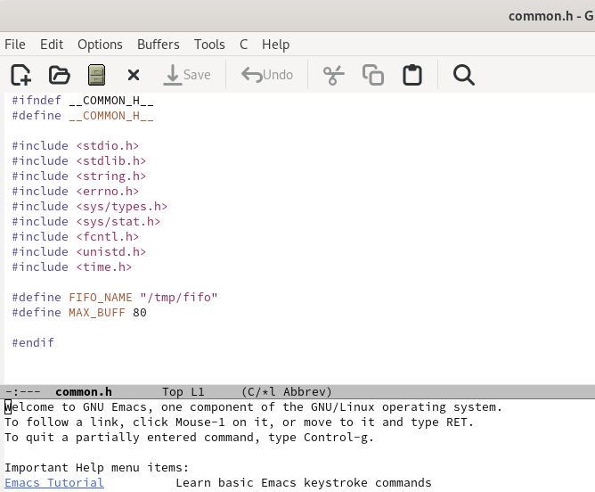
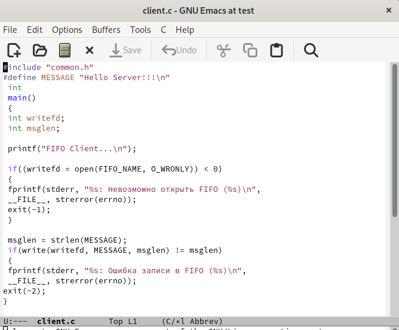
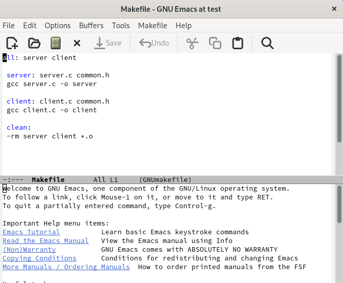
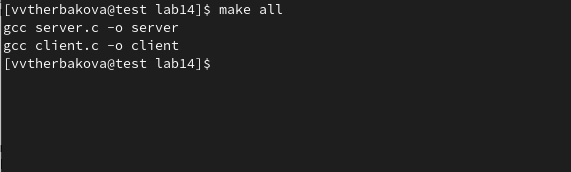
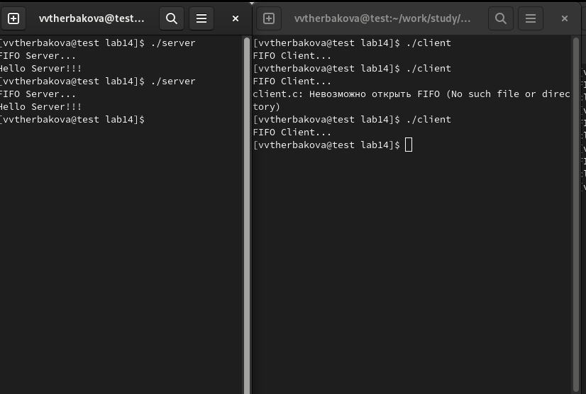

---
## Front matter
lang: ru-RU
title: Лабораторная работа №14
subtitle: Операционные системы
author:
  - Щербакова В.В.
institute:
  - Российский университет дружбы народов, Москва, Россия
  - Объединённый институт ядерных исследований, Дубна, Россия
date: 16 марта 2023

## i18n babel
babel-lang: russian
babel-otherlangs: english

## Formatting pdf
toc: false
toc-title: Содержание
slide_level: 2
aspectratio: 169
section-titles: true
theme: metropolis
header-includes:
 - \metroset{progressbar=frametitle,sectionpage=progressbar,numbering=fraction}
 - '\makeatletter'
 - '\beamer@ignorenonframefalse'
 - '\makeatother'
---

# Информация

## Докладчик

:::::::::::::: {.columns align=center}
::: {.column width="70%"}

  * Щербакова Вероника Владимировна
  * студентка 1-го курса
  * Бизнесс-Информатика
  * Российский университет дружбы народов
 

:::
::: {.column width="30%"}

:::
::::::::::::::

# Вводная часть

## Актуальность

- Для тех, кто хочет научиться управлять процессами (и заданиями), по
проверке использования диска и обслуживанию файловых систем


## Цели и задачи

Приобретение практических навыков работы с именованными каналами

## Материалы и методы

- Процессор `pandoc` для входного формата Markdown
- Результирующие форматы
	- `pdf`
	- `html`
- Автоматизация процесса создания: `Makefile`

# Создание презентации

## Процессор `pandoc`

- Pandoc: преобразователь текстовых файлов
- Сайт: <https://pandoc.org/>
- Репозиторий: <https://github.com/jgm/pandoc>

## Формат `pdf`

- Использование LaTeX
- Пакет для презентации: [beamer](https://ctan.org/pkg/beamer)
- Тема оформления: `metropolis`

## Код для формата `pdf`

```yaml
slide_level: 2
aspectratio: 169
section-titles: true
theme: metropolis
```

## Формат `html`

- Используется фреймворк [reveal.js](https://revealjs.com/)
- Используется [тема](https://revealjs.com/themes/) `beige`

## Код для формата `html`

- Тема задаётся в файле `Makefile`

```make
REVEALJS_THEME = beige 
```
# Результаты

## Получающиеся форматы

- Полученный `pdf`-файл можно демонстрировать в любой программе просмотра `pdf`
- Полученный `html`-файл содержит в себе все ресурсы: изображения, css, скрипты


## Содержание исследования
1.  Создать файлы: 
{#fig:001 width=90%}
2. подстроить под себя программы:
{#fig:002 width=90%}
{#fig:003 width=90%}
{#fig:004 width=90%}
{#fig:005 width=90%}
3. запустить:
{#fig:006 width=90%}
{#fig:007 width=90%}

## Результаты

- Oбрели практические навыки работы с именованными каналами

## Итоговый слайд

- Спасибо за внимание


:::

