---
## Front matter
title: "1 часть рпоекта"
subtitle: "Операционные системы"
author: "Щербакова Вероника НБИбд-03-22"

## Generic otions
lang: ru-RU
toc-title: "Содержание"

## Bibliography
bibliography: bib/cite.bib
csl: pandoc/csl/gost-r-7-0-5-2008-numeric.csl

## Pdf output format
toc: true # Table of contents
toc-depth: 2
lof: true # List of figures
lot: true # List of tables
fontsize: 12pt
linestretch: 1.5
papersize: a4
documentclass: scrreprt
## I18n polyglossia
polyglossia-lang:
  name: russian
  options:
	- spelling=modern
	- babelshorthands=true
polyglossia-otherlangs:
  name: english
## I18n babel
babel-lang: russian
babel-otherlangs: english
## Fonts
mainfont: PT Serif
romanfont: PT Serif
sansfont: PT Sans
monofont: PT Mono
mainfontoptions: Ligatures=TeX
romanfontoptions: Ligatures=TeX
sansfontoptions: Ligatures=TeX,Scale=MatchLowercase
monofontoptions: Scale=MatchLowercase,Scale=0.9
## Biblatex
biblatex: true
biblio-style: "gost-numeric"
biblatexoptions:
  - parentracker=true
  - backend=biber
  - hyperref=auto
  - language=auto
  - autolang=other*
  - citestyle=gost-numeric
## Pandoc-crossref LaTeX customization
figureTitle: "Рис."
tableTitle: "Таблица"
listingTitle: "Листинг"
lofTitle: "Список иллюстраций"
lotTitle: "Список таблиц"
lolTitle: "Листинги"
## Misc options
indent: true
header-includes:
  - \usepackage{indentfirst}
  - \usepackage{float} # keep figures where there are in the text
  - \floatplacement{figure}{H} # keep figures where there are in the text
---

# Цель работы

Создать сайт и подготовить его к заполнению данных

# Задание

Здесь приводится описание задания в соответствии с рекомендациями
методического пособия и выданным вариантом.

# Теоретическое введение

# Выполнение лабораторной работы

1. скачиваем hogo
{#fig:001 width=90%}
2. создаем 1 репозиторий через шаблон называем его blog
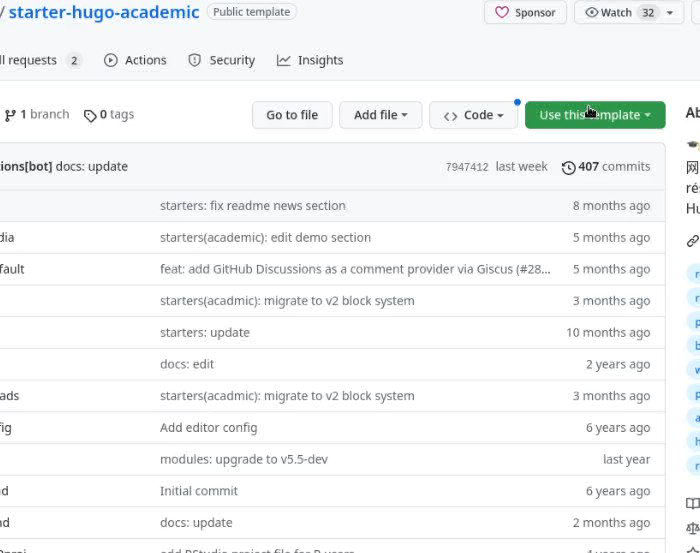{#fig:002 width=90%}
{#fig:003 width=90%}
3. клонируем репзиторий
{#fig:004 width=90%}
4. после удасного ~/bin/hugo появится ссылка
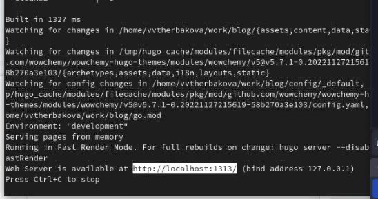{#fig:005 width=90%}
5. перешли
{#fig:006 width=90%}
6. создание 2 репозитория под своим именем в гитхаб
{#fig:007 width=90%}
7. клонируем 2 репозиторий 
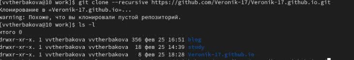{#fig:008 width=90%}
8. переход в каталог 
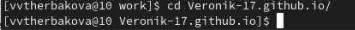{#fig:009 width=90%}
9. создаем ветку
{#fig:010 width=90%}
10. создаем файл 
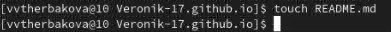{#fig:011 width=90%}
11. добавили файл
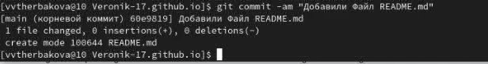{#fig:012 width=90%}
12. отправляем на гитхаб
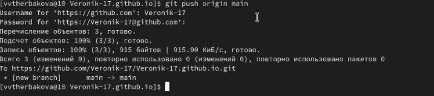{#fig:013 width=90%}
13. выполнение снова ~/bin/hugo ,просматриваем все файлы
{#fig:014 width=90%}
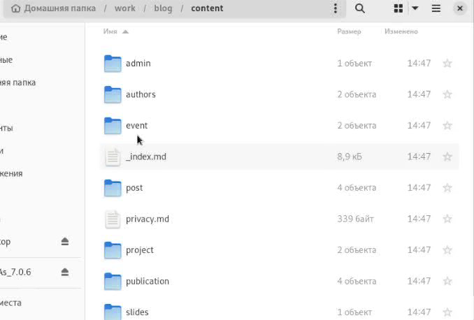{#fig:015 width=90%}
14. проверяем, что бы было подключено к репозиторию
15. добавляем сайт
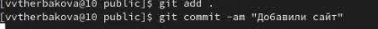{#fig:016 width=90%}
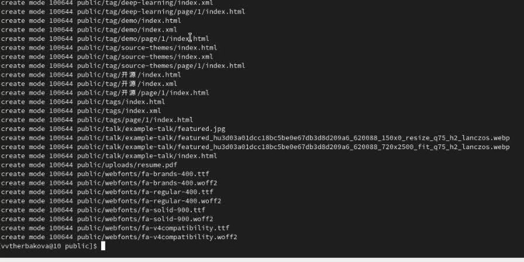{#fig:017 width=90%}
16. выгружаем
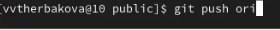{#fig:018 width=90%}

# Выводы

Подготовили сайт к его заполнению

# Список литературы{.unnumbered}

::: {#refs}
:::
